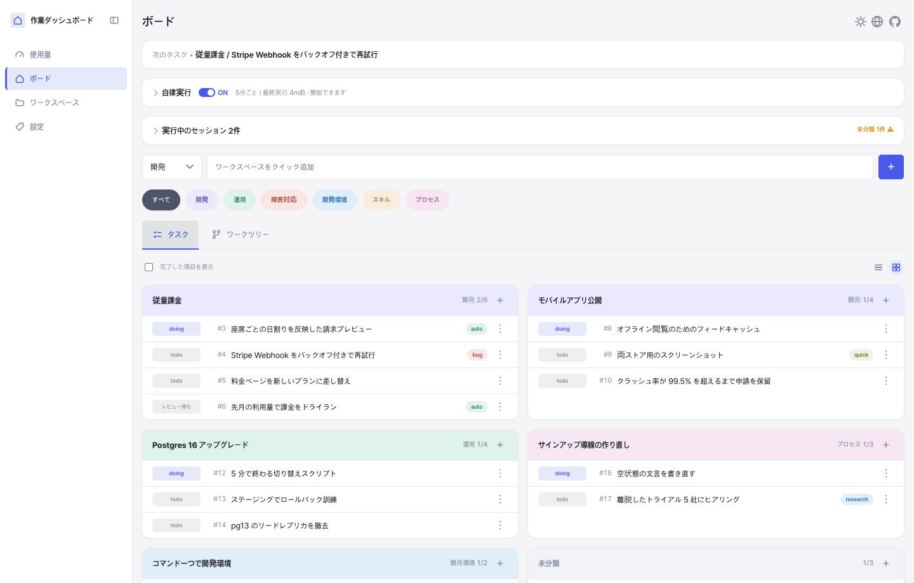
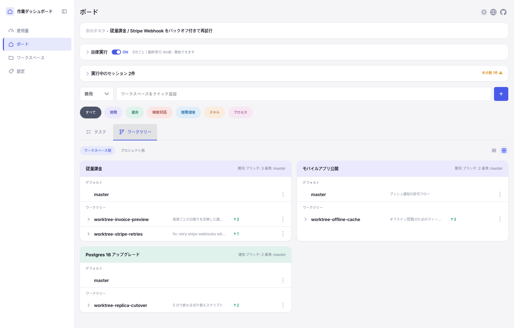
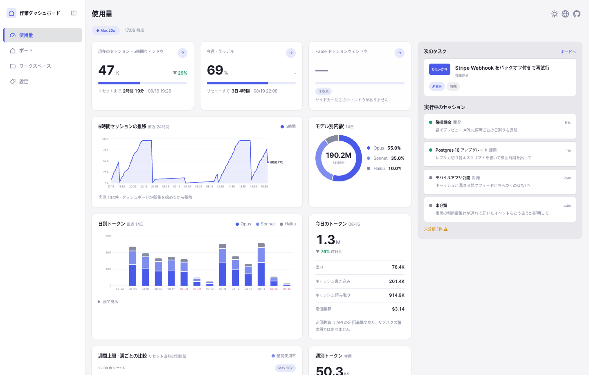

# ワークダッシュボード

[English](../../README.md) · [한국어](../ko-KR/README.md) · **日本語** · [中文](../zh-CN/README.md)

Claude Code と一緒に作業する人のためのローカル作業管理ツール。人はブラウザから、
Claude は CLI から操作し、両者が同じ SQLite ファイルを読み書きする。フレームワークも
バンドラーも `pip install` も不要。

作業は **カテゴリ → ワークスペース → タスク** の 3 階層で管理する。その上で Claude Code
のセッションが一つずつ登録され、ワークスペースに分類され、実際に着手しているタスクへ
リンクされる。だからボードには常に何が動いているかが映り、次のセッションは状況を
把握した状態で始められる。

> [!NOTE]
> 1 人用で認証はなく、外部サービスも使わない。すべては自分のマシン上の SQLite
> ファイル 1 つに収まっている。



タスク 1 つが、それに取り組んでいるセッションとワークツリーを抱える。フックがプロンプト
送信時に `working`、停止時に `idle` を記録するので、こちらの入力を待っているセッションが
まだ動いているセッションと同じには見えない。



ワークツリーのサブタブは、各ブランチがどれだけ離れたか、そのセッションが何をしていたかを
示し、ケバブメニューからマージや開発サーバーの起動ができる。



使用量ビューはローカルの Claude Code ログを読み、利用上限ウィンドウと日次のトークン・
コスト推移を描く。

## 特徴

- **3 階層ボード** — カテゴリがワークスペースをまとめ、ワークスペースがタスクを持つ。
  優先度は並び順だけで表し、すべてドラッグで並べ替えられる。
- **セッションのリアルタイム追跡** — フックが Claude Code のセッションを登録し、
  ワークスペースのコンテキストを注入し、作業中もボードを同期し続ける。
- **ワークツリー管理** — 各 git ワークツリーの状態とコミットを確認し、その開発サーバーを
  ボードから直接 起動・再起動・停止できる。
- **マージはワンコマンド** — 状態確認 → 対象ブランチの取り込み → テスト → マージ →
  タスク・サーバー・ブランチの解放、をこの順に行う。
- **自律実行** — ラベルの付いたタスク 1 件を 5 分間隔の cron でバックグラウンドの
  `claude` ジョブに任せる。既定はオフ。
- **使用量ビュー** — ローカルの Claude Code ログから読んだ利用上限ウィンドウと、
  日次のトークン・コスト推移。
- **ステータスライン** — 現在のタスク・ワークツリー・サーバーポートを Claude Code の
  ステータスラインに描画する。
- **UI 言語 4 種** — 英語(既定)・韓国語・日本語・中国語。地球アイコンから切り替える。
  サーバーが返す文言も選んだ言語に従う。
- **ライト・ダーク** — 太陽と月のアイコンから、端末の設定 / ライト / ダークを選ぶ。
  アカウントではなくブラウザごとに残る。

## 必要なもの

| | |
| --- | --- |
| 必須 | Python 3.9+(標準ライブラリのみ)、Git、モダンブラウザ |
| 任意 | Claude Code — セッション追跡・ステータスライン・自律実行に必要 |
| 任意 | Node.js — テストの一部の画面チェックが `node` で動く |
| 任意 | `PATH` 上の `markdownlint-cli2` — Markdown lint フックが使う |
| 任意 | `ssl` が使える Python — Google Tasks 同期に必要。同じ 3.9 でもビルドによっては欠けているので `python3 -c "import ssl"` で確認する。`start.sh` が使えるものを選び、`WORK_DASHBOARD_PYTHON` で指定もできる |

## クイックスタート

```bash
git clone https://github.com/yujung7768903/work-dashboard.git
cd work-dashboard
./setup.sh
./start.sh
```

そして `http://127.0.0.1:9080` を開く。DB は初回接続時に作られるので、マイグレーションの
手順はない。

`setup.sh` は[フック](#フック)を `~/.claude/settings.json` に 8 項目、絶対パスで登録する。
二度目の実行は「変更なし」と出すだけで、チェックアウトを移した後は項目を増やさずパスを
書き換える。自分で足したフックはそのまま残り、前のファイルは `settings.json.bak` になる。

次に Claude Code のセッションを開く。ワークスペースがまだ無ければ、そのセッションに初期
設定の手順が注入される — `~/.claude/projects` の最近の履歴をセッション 1 行に要約して読み、
まとめてワークスペースと ToDo を提案し、こちらが直したものだけを DB に書く。使わないなら
`python3 dash.py onboard --skip` で二度と出ないようにする。

```bash
./start.sh --port 9081     # 別のポート。たとえばワークツリー用
./start.sh --lan           # スマホやタブレットからも開けるように
./restart.sh               # このディレクトリから起動したサーバーを再起動
./stop.sh                  # 停止
./stop.sh --port 9081      # そのポートで動いているものだけ
python3 server.py          # フォアグラウンドで実行
```

`start.sh` は引数をそのまま `server.py` に渡し、pid とログのパスを表示する。ログは
1 日 1 ファイル(`logs/YYYY-MM-DD.log`)で、7 日以上触れられていないファイルは次回起動時に
削除される。

`stop.sh` と `restart.sh` は、このディレクトリを作業ディレクトリとするサーバーだけを
対象にする。ワークツリーのサーバーとメインチェックアウトのサーバーが互いを止めることは
ない。1 つのディレクトリで複数動いているときは `--port` で対象を絞る。

`--lan` は `start.sh` 自身が解釈する唯一のフラグで、`0.0.0.0` にバインドしたうえで、
他の端末にそのまま貼り付けられるアドレス(`http://192.168.x.x:9080`)を表示する —
`server.py` がそのまま返す `0.0.0.0` ではなく。

> [!WARNING]
> `--lan` を付けると、同じネットワーク上の誰でもダッシュボードを開ける。認証はない。

9080 はメインチェックアウトの席だ。常に同じアドレスであるためで、ワークツリーは 9081
から使う。ワークツリー内で起動した `server.py` は `--port 9080` を拒否する。

## Web 画面

| タブ | 内容 |
| --- | --- |
| ボード | ツリー全体、次にやるタスク、実行中セッション(2 秒ポーリング)、自律実行スイッチ |
| ワークスペース | ワークスペースの作成と、背景・目的・ゴール・考慮事項の編集 |
| 設定 | カテゴリとラベル |
| 使用量 | 利用上限ウィンドウとトークン・コスト推移 |

ボードにはサブタブが 2 つある — **タスク** と **ワークツリー**。ワークツリーのサブタブ
では、各行のケバブメニュー(⋮)からそのワークツリーを適用(マージ)・削除し、サーバーを
起動・再起動・停止する。このサブタブはワークスペース別・プロジェクト別にまとめて表示で
き、プロジェクト別ビューではどのワークスペースにも紐づかないワークツリーも並ぶ。どちら
のサブタブもカードを 1 列・2 列に切り替えられ、左のレールはアイコンだけに畳める。

タスクの行とセッションの行は同じダイアログを開き、ダイアログはタブ 3 つで構成される。

| ダイアログのタブ | 内容 |
| --- | --- |
| 概要 | タイトル、履歴、着手条件、コンテキストノート全文 |
| セッション | セッション id・場所・直近 10 件のやり取り、ワークスペース/カテゴリの指定 |
| ワークツリー | そのタスクが使ったワークツリー — 状態・履歴・コミット |

## CLI

`dash.py` は Claude Code が使うエントリポイント。すべてのコマンドが Web と同じ DB を
見るので、片方の変更はもう片方で再読み込みすれば反映される。

### ボード

```bash
python3 dash.py ls                                   # ツリー全体
python3 dash.py next                                 # 次にやるタスク 1 件
python3 dash.py show <ワークスペースid|JIRA-1>         # ワークスペース詳細
python3 dash.py add-category <名前>
python3 dash.py add-workspace <カテゴリ> <名前> [--background ...] [--jira KEY]
python3 dash.py add-todo <タイトル> [--workspace ID] [--note ...] [--precondition ...]
python3 dash.py move-todo <タスクid> --workspace <id|none>
python3 dash.py set-status <todo|workspace> <id> <状態>
python3 dash.py reorder <categories|workspaces|todos> <ids...>
python3 dash.py done-today [--date YYYY-MM-DD]
```

### セッション

```bash
python3 dash.py sessions                             # 実行中のセッション
python3 dash.py classify --category <名前> [--workspace <id>]
python3 dash.py link-todo <タスクid> [--status done] [--past]
python3 dash.py show-todo --session
python3 dash.py show-note <タスクid>                  # コンテキストノート全文
```

`link-todo` は、このセッションがそのタスクに着手したという宣言であり、タスクを `doing`
に進める。実際に取り組んでいるものだけを紐づける — `merge` はセッションに紐づいた
タスクをすべて閉じるので、後回しのために作った後続タスクは、実際に着手するセッションが
紐づけるまで紐づけない。`--past` は終わった履歴セッションを紐づけ、状態は変えない。

セッション引数は省略できる。省略すると、Claude Code がセッションの起動する全プロセスに
渡す `CLAUDE_CODE_SESSION_ID` から自分のセッションを特定する。

### ワークツリーとマージ

```bash
python3 dash.py merge                        # 確認 → 対象の取り込み → テスト → マージ → 解放
python3 dash.py merge --message "タイトル"    # マージコミットのタイトル
python3 dash.py merge --test "npm test"      # tests/__main__.py がないリポジトリ
python3 dash.py merge --no-test
python3 dash.py finish [--worktree PATH]     # 解放のみ — タスクを done、サーバーを停止
python3 dash.py statusline <セッション> [--cwd PATH]
```

`merge` は対象ブランチをワークツリーへ取り込んだ後にテストを **1 回だけ** 走らせる。
テストしたツリーがそのままマージされるツリーになる。コンフリクトで止まったら、ファイルを
解決して `git add` し、同じコマンドをもう一度実行すれば続きから進む。push はせず、
ワークツリーの削除もしない — それは `ExitWorktree` の役目。

### 初期設定・言語・自律実行

```bash
python3 dash.py onboard [--skip]             # 初期設定がまだ必要な状態か
python3 dash.py scan-history --days 7        # 過去セッションごとに 1 行の要約
python3 dash.py language [en|ko|ja|zh]       # 引数なしなら現在の値
python3 dash.py usage                        # 利用上限とトークン推移
python3 dash.py autorun on|off|status
python3 dash.py autorun-tick [--dry-run]     # 5 分 cron が呼ぶエントリポイント
python3 dash.py autorun-prompt <タスクid>     # 自律セッションに入る指示の全文
python3 dash.py autorun-request "<理由>"      # 判断を保留し、人に決定を求める
python3 dash.py autorun-finish               # 完了 — レビュー待ちへ
```

## Claude Code 連携

### セッションコンテキスト

フックはセッションごとに `<work-dashboard state="...">` ブロックを **1 つだけ** 注入する。
どれが入るかはボードの状態で決まる。

| 状態 | 条件 | 注入される内容 |
| --- | --- | --- |
| `classified` | ブランチの Jira ID で一致したか、`classify --workspace` で紐づいたワークスペースがある | 背景・目的・ゴール・考慮事項、タスク一覧、スコープ遵守の指針 |
| `onboarding` | ワークスペースが 1 つもなく、ユーザーが拒否もしていない | 初期設定の手順 |
| `unclassified` | それ以外 | 現在地・ブランチ、カテゴリ、進行中ワークスペース、分類手順 |
| `released` | このセッションが取ったタスクがすべて `done` | 新しい依頼は終わったタスクに乗せず、新しいタスクとして受けるよう指示 |

分類そのものは自動ではない — シェルには質問が何についてのものか分からない。フックは指示を
注入するだけで、Claude が `classify` と `link-todo` で登録する。

### フック

すべてのフックは、どんな失敗でも黙って `exit 0` で終わる。ダッシュボードの不調で
セッションが開けなくなったり、ファイルを編集できなくなったりしてはならない。`exit 2` は
ブロックすること自体が目的の場合にだけ使う。

| フック | イベント | 役割 |
| --- | --- | --- |
| `hooks/dash_hook.py` | `SessionStart`・`UserPromptSubmit`・`Stop`・`SessionEnd` | セッションの登録と状態追跡、上記コンテキストブロックの注入 |
| `hooks/worktree_serve.py` | `Stop` | 変更したワークツリーを提供するサーバーがなければブロックし、空きポート(9081–9139)を渡す |
| `hooks/worktree_guard.py` | `PreToolUse`(`Write`・`Edit`・`NotebookEdit`) | `~/work/` のメインチェックアウトでのソース編集をブロック。`ALLOW_MAIN_CHECKOUT=1` で回避 |
| `hooks/commit_scope_guard.py` | `PreToolUse`(`Bash`) | pathspec のない `git add -A`・`git commit -a` をブロック。`ALLOW_BROAD_COMMIT=1` で回避 |
| `hooks/md_lint.py` | `PostToolUse`(`Write`・`Edit`・`NotebookEdit`) | このリポジトリに保存された `.md` を `markdownlint-cli2` で検査 |
| `hooks/stale_base.py` | `UserPromptSubmit` | ブランチが upstream や基準ブランチより遅れていればセッションにつき 1 回警告 |

`worktree_serve.py` はこのリポジトリの `.claude/settings.json` に登録済みなので、clone
した直後でも設定は不要。残る 5 つは `./setup.sh` が `~/.claude/settings.json` に絶対パスで
登録する。パスはワークツリーではなくメインチェックアウトを指す必要がある — ワークツリーは
マージ後に削除されるからだ。手で入れるならこの形になる。

```json
{
  "hooks": [
    {
      "type": "command",
      "command": "python3 /絶対パス/work-dashboard/hooks/dash_hook.py SessionStart",
      "timeout": 2
    }
  ]
}
```

`dash_hook.py` はイベント名を唯一の引数として受け取るので、最後の引数だけを変えて
イベントごとに 1 つずつ追加する。

### ステータスライン

`~/.claude/statusline-command.js` が `dash.py statusline <セッション> --cwd <パス>` を呼び、
その出力を使用率バーの下の 2 行目に描く。

```text
Context ████░░░░░░ 42% │ Usage ███░░░░░░░ 30% │ Weekly ██████░░░░ 55%
[doing | tab-underline | :9092] ボードのタスクとワークツリーをサブタブに分割
```

角かっこの中は常に **状態 | ワークツリー | ポート** の順で、欠けている項目は区切りごと
消える。3 つとも無ければ角かっこ自体が出ない。

### 自律実行

`autorun on` にすると、5 分間隔の cron がタスクを 1 件選び、バックグラウンドの `claude`
ジョブとして実行する。対象は `auto` ラベルの付いたタスクだけ — 自律実行の許可は人が
与えるものであって、コードが推測するものではない。既定はオフで、自動的に再びオンになる
経路はない。

```cron
*/5 * * * * /usr/bin/python3 /絶対パス/work-dashboard/dash.py autorun-tick >/dev/null 2>&1
```

対象がない tick は何もしない。デーモンではなく cron にしている理由がこれだ。

## Google Tasks 双方向同期

スマホからタスクを見てチェックしたくて付けた。Google は 1 段のネストしか許さないので、
3 つの層がそのまま収まる。

```text
Google のリスト        =  カテゴリ
 └ トップレベルタスク   =  ワークスペース
    └ サブタスク        =  そのワークスペースのタスク
```

リスト名はカテゴリ名**そのまま**。接頭辞を付けると、スマホで手作りしたリストが永遠に
結び付かず、同じ名前が 2 つずつ増えていく。

構造は双方向にそのまま行き来する。**スマホで作ったトップレベルはワークスペースになり、
その下はそのワークスペースのタスクになる。** ワークスペースを持たないタスクもトップレベル
として上がるが、上げた後にリンクが残るので次の回では「すでに相方がいるもの」として外れる
— **相方のいないトップレベルだけ**をワークスペースとして受けるため、回を重ねても増えない。

### 初回だけの設定

**ターミナルを使わず画面だけで終えられる。** 設定タブの `連携する` を押すと、認証情報を
どこで取るかを手順で案内し、取ってきた 2 つの値を受け取って
`~/.claude/work-dashboard/gtasks.json`(パーミッション 600)に保存したうえで同意画面まで
開く。入力した値は同意に失敗しても残るので、打ち直さなくていい。

案内の中身はこうだ。[Google Cloud Console](https://console.cloud.google.com/) で
プロジェクトを作り、**Google Tasks API** を有効にし、**認証情報 → OAuth クライアント
ID → デスクトップアプリ**でクライアントを作る。

ターミナルからやる場合は下記。認証情報は**引数 > 環境変数 > `gtasks.json`** の順で探す。

```bash
# (a) 環境変数 — シェル履歴に secret が残らない
GTASKS_CLIENT_ID=<ID> GTASKS_CLIENT_SECRET=<SECRET> python3 dash.py gtasks-auth

# (b) 先にファイルへ書いておけば、このコマンドに引数は要らない
cat > ~/.claude/work-dashboard/gtasks.json <<'EOF'
{ "client_id": "<ID>", "client_secret": "<SECRET>" }
EOF
chmod 600 ~/.claude/work-dashboard/gtasks.json
python3 dash.py gtasks-auth

# (c) フラグ — 履歴に残るので勧めない
python3 dash.py gtasks-auth --client-id <ID> --client-secret <SECRET>
```

承認が終わると同じファイルに `refresh_token` が加わって 3 つのキーになる。
**`refresh_token` は手で書き足せない** — Google の同意画面を通らないと発行されない。
他で取得済みのものがあれば 3 つのキーを直接書き込み、`gtasks-auth` を飛ばしてもいい。
ブラウザが自動で開かない環境(ヘッドレス・既定ブラウザ未設定)では、待たずに承認 URL を
画面に返す。

### 設定画面

認証だけではまだ何も動かない。**オンにする前に、まずカテゴリを合わせる。**

1. `連携する` — 認証がないときだけ出る。取得済みの認証情報があれば案内と入力は飛ばす
2. `カテゴリを合わせる` — 両側のリストを読み、**選べる候補をチェックボックスで、両側の
   件数付きで**見せる。3 つの組に分かれる: 両側にある(選ぶと統合される) /
   ダッシュボードだけ / Google だけ
3. `同期を開始` — **選んだものだけ**を反対側に作り、リンクし、オンにする。選ばなかった
   ものは**どちらにも作らない**。タスクの同期はここではやらない
4. その後になってマスターの ON/OFF とカテゴリ単位の on/off が出る。**カテゴリは全部オフの
   状態から始まる** — リストを合わせることと、タスクをやり取りすることは別の判断であり、
   オンで始めると最初の同期が全カテゴリのタスクを一度にスマホへ上げてしまう。マスターを
   切ると**値はそのままに**グレーで固める

**件数を一緒に見せるのが肝だ。** 名前が同じでも同じものとは限らない —
ダッシュボードの `勉強`(タスク 2 件)とスマホの `勉強`(61 件)は別物なのに、名前だけ見て
オンにすると 2 つの塊が一度に混ざる。戻す手段がないので、選ぶ前に両側の大きさを見せる。

選択のポップアップは**2 番の一度きり**だ。その後にマスターを切り替えるのはスイッチ 1 つで
済む — すでに合わせたリストをオンにするたび確認を取り直す理由はない。合わせる前はオンに
するものがないので、スイッチ自体を隠す。合わせた後で Google のリストをさらに取り込みたい
ときは `カテゴリを追加` を押す — すでに連携済みのものはロックされた状態で並ぶ。

`連携を解除` は Google の**アカウント承認だけ**を捨てる。両側のタスクも、カテゴリの
リンクも、`client_id`/`client_secret` もそのまま残るので、つなぎ直せば続きから同期する。
ただし `meta.gtasks_seen_ids` は空にする — それが残っていると、つなぎ直したときに、その間
に消えたタスクを「スマホで消した」と読んで無事なタスクを消してしまう。

問題が起きても**連携を自動でオフにはしない。** Wi-Fi が一度切れただけで設定が切れたら、
ユーザーはそれに気づかないまま何日も過ごす。代わりにタイトルの右へ `⚠ ログイン期限切れ`
のように理由だけを出す。切る判断は人がする。理由は最後の同期が
`gtasks_state.last_error` に残したものを読む — 設定タブを開くたびに Google へ問い合わせは
しない。

### 同期

**`gtasks-sync` に引数はない。** 認証情報は上の 1 回で終わりで、以降は保存した
`refresh_token` からアクセストークンを自分で取って使う。**連携がオフなら何もせずに
終わる** — cron が毎回呼ぶ場所なので、これは失敗として扱わない。

```bash
python3 dash.py gtasks-sync --dry-run   # 何が変わるかだけ報告し、何も書かない
python3 dash.py gtasks-sync
```

**最初の実行は `--dry-run` で確認する** — 未完了のタスクが全部 Google 側に作られる。

Webhook のない API なので、定期的に呼ぶ以外に方法がない。**既定で登録される自動実行は
ない** — 仕掛けておかなければ `今すぐ同期` を押したときだけ動く。設定画面はその状態を
そのまま表示する(`自動実行なし`)。間隔を定数で書かず、`launchd`
(`~/Library/LaunchAgents/*.plist` の `StartInterval`)と `crontab -l` から `gtasks-sync`
を探して読む — 何も仕掛けていない人に「10 分ごと」と書いたら嘘になるからだ。

```bash
# 10 分ごと。crontab -e
*/10 * * * * cd ~/work/work-dashboard && /usr/bin/python3 dash.py gtasks-sync >> /tmp/gtasks.log 2>&1
```

### 同期のルール

| 項目 | 方向 | 衝突したとき |
| --- | --- | --- |
| タイトル | 双方向 | `updated_at` と `updated` の新しい方が勝つ |
| 完了状態 | 双方向 | 同上 |
| ノート・着手条件 | 送るだけ | スマホで直してもダッシュボードは変わらない |
| ワークスペースの背景・目的・ゴール・考慮事項 | 送るだけ | `notes` の 1 枠に 4 行で載る |
| ラベル | 同期しない | — |

- **中身が実際に違うときだけ**時刻を見る。そうしないと、こちらが今押し込んだせいで
  リモートが常に新しく見え、無限に往復する。
- 時刻は秒で切り捨てて比べる。`db.now()` は秒までしか書かず Google はミリ秒まで返すので、
  そのままだと同じ秒に直したローカルの変更が黙って巻き戻る。
- 同点ならローカルが勝つ。
- スマホからの完了がローカルのルール(自律実行のレビュー待ちなど)に阻まれたら、
  **飛ばして報告する**。ローカルのルールが勝つ。
- スマホには `todo`/`doing` の区別がない。スマホで完了を外すと `doing` だったものも `todo`
  で降りてくる。ワークスペースも同様に `paused` ではなく `active` に戻る。
- カテゴリのスイッチを切れば、そのカテゴリは丸ごと飛ばす。リストのリンクは残るので、
  また入れてもリストが新しくできることはない。

### 削除

`meta.gtasks_seen_ids` に前回のタスク id を残しておくことが、「スマホで新しく作ったもの」と
「ダッシュボードで消したもの」を分ける唯一の根拠だ。

| 状況 | 処理 |
| --- | --- |
| ダッシュボードで削除 | Google 側でも削除 |
| スマホで削除(未完了) | ダッシュボードでも削除 |
| スマホで削除(完了済み) | そのまま — 「完了項目を削除」が墓を掘り返してはいけないので |

完了分はリンクも残す。リンクを消すと、次の回が「まだ上げていないもの」と見て墓を掘り
返してしまう。

削除するには**前回に見たという証拠**(`gtasks_seen_ids`)が要る。リンクがあるのに見た記録が
なければ、リストかアカウントが変わったということなので、消さずにもう一度上げる — この条件
がないと、別のアカウントに移った瞬間すべてのリンクが一斉に見知らぬものになり、未完了の
タスクが全滅する。

**ワークスペースを消すときが厄介だ。** Google はトップレベルを消すと下も一緒に消すが、
ダッシュボードでは所属タスクが未分類で生き残る。そのタスクのリンクをそのままにすると、
次の回が「スマホで消した」と読んで無事なタスクを消してしまう。そこで、トップレベルを消す
前に一緒に消えるサブタスクのリンクを切り、同じ回でトップレベルタスクとして上げ直す。

## 設定

| 項目 | 場所 |
| --- | --- |
| DB | `~/.claude/work-dashboard/dash.db`。`WORK_DASHBOARD_DB` で上書き |
| ホスト・ポート | `server.py --host` / `--port`(既定 `127.0.0.1:9080`) |
| UI 言語 | 地球アイコン、または `dash.py language`。`meta.language` に保存 |
| 表示の好み | 明るさ・ボードの列数・レールの畳み — ブラウザの `localStorage` に保存 |
| UI 文言 | `static/lang/{en,ko,ja,zh}.json`。キーは共通で、英語がフォールバック |
| デザイントークン | `static/css/app.css` の `:root` — 余白・文字・角丸の唯一の出典 |
| Markdown ルール | `.markdownlint.json` |

## データモデル

SQLite を Web サーバー・CLI・フックが直接開く。仲介するプロセスはない。`connect()` が
スキーマを作り、外部キーと WAL を有効にし、既定カテゴリ 6 件を初回だけ投入する。
`*_at` 列はすべて ISO 8601 UTC のテキスト。

| テーブル | 役割 |
| --- | --- |
| `categories` | 最上位のグルーピング。優先度には関与しない。`google_list_id` が Google のリスト、`gtasks_enabled` がカテゴリ単位の同期 on/off(既定はオフ) |
| `workspaces` | ブランチや Jira 単位の作業。背景・目的・ゴール・考慮事項を保持。`google_task_id` で Google のトップレベルタスクと結ぶ |
| `todos` | タスク。ワークスペースに属することも、カテゴリ直下に置くこともできる。`google_task_id` で Google のサブタスクと結ぶ |
| `labels`・`todo_labels` | ラベルはタスクの性質なので、1 件に複数付く |
| `sessions` | Claude Code のセッション。フックが登録・更新する |
| `session_todos` | セッションが取ったタスク。セッションのワークスペースはここから導かれる |
| `worktrees` | ワークツリーの履歴。マージや削除でディレクトリが消えても残る |
| `usage_samples` | 使用量ビューが使う上限・トークンのサンプル |
| `autorun_state`・`autorun_runs` | 自律実行の設定と実行記録 |
| `gtasks_state` | Google Tasks 連携の設定 — `enabled`・`last_sync_at`・`last_error`。`autorun_state` と同じ理由で単一行 |
| `meta` | 単一値の設定と内部フラグ。`gtasks_seen_ids` もここ |

## プロジェクト構成

```text
work-dashboard/
├── dash.py               # CLI エントリポイント — 解析・委譲・出力のみ
├── server.py             # HTTP エントリポイント(http.server、フレームワークなし)
├── setup.sh              # フックを ~/.claude/settings.json に登録
├── start.sh              # バックグラウンド起動、日付別ログ、7 日で整理
├── stop.sh · restart.sh  # このディレクトリのサーバーだけを扱う
├── serving.sh            # サーバー検出・停止の共通関数
├── app/
│   ├── constants.py      # マジックナンバーはすべてここへ
│   ├── db.py             # 接続・スキーマ・トランザクション
│   ├── repositories/     # エンティティ別の保存・取得と整合性ルール
│   └── services/         # 複数エンティティにまたがるロジック
├── hooks/                # Claude Code フック
├── static/               # ES モジュールのフロントエンド(バンドラーなし)
│   ├── index.html        # 単一ページ。文言は持たず data-i18n キーだけを持つ
│   ├── lang/             # en · ko · ja · zh、キー集合は同一
│   ├── css/              # app.css がトークンを定義し、usage.css は参照のみ
│   └── js/               # boot・i18n・theme・layout・board・workspace・sessions・usage
├── tests/                # python3 -m tests
└── docs/superpowers/     # 設計ドキュメントと計画
```

## テスト

```bash
python3 -m tests
```

リポジトリ・サービス・CLI・フックを対象にし、4 つの言語ファイルでキーとプレースホルダーが
一致することを確認し、CSS の余白と文字が生の px ではなくデザイントークンを使うことを
強制する。画面の挙動チェックは `node` で動き、同名の Python テストが呼び出す。`start.sh`
などのスクリプトを実際に実行するテストは 9900–9999 番でサーバーを起動し、この帯域は
画面には描かれない。

## 設計ドキュメント

`docs/superpowers/specs/` に段階ごとの設計と確定した決定が、`docs/superpowers/plans/` に
実装計画が置かれている。
