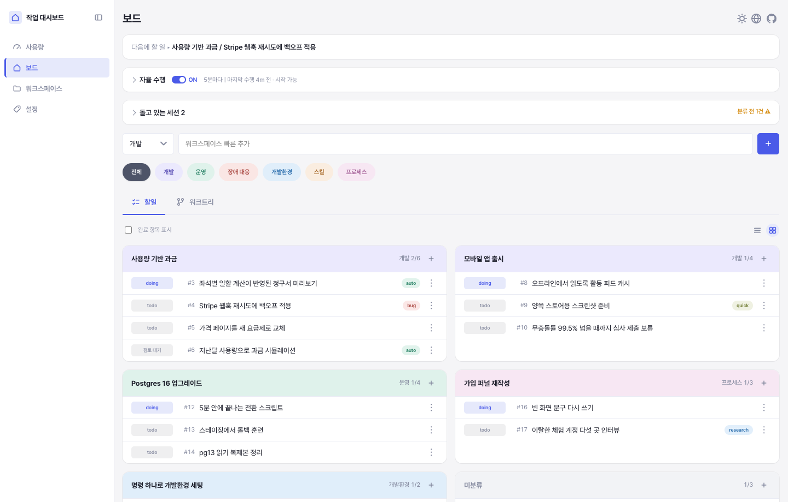
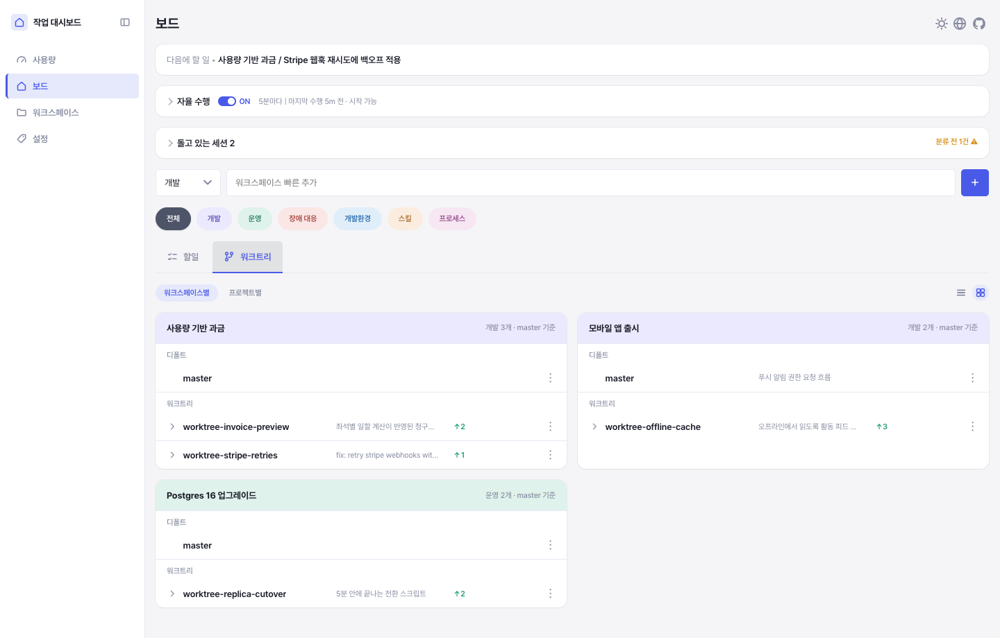
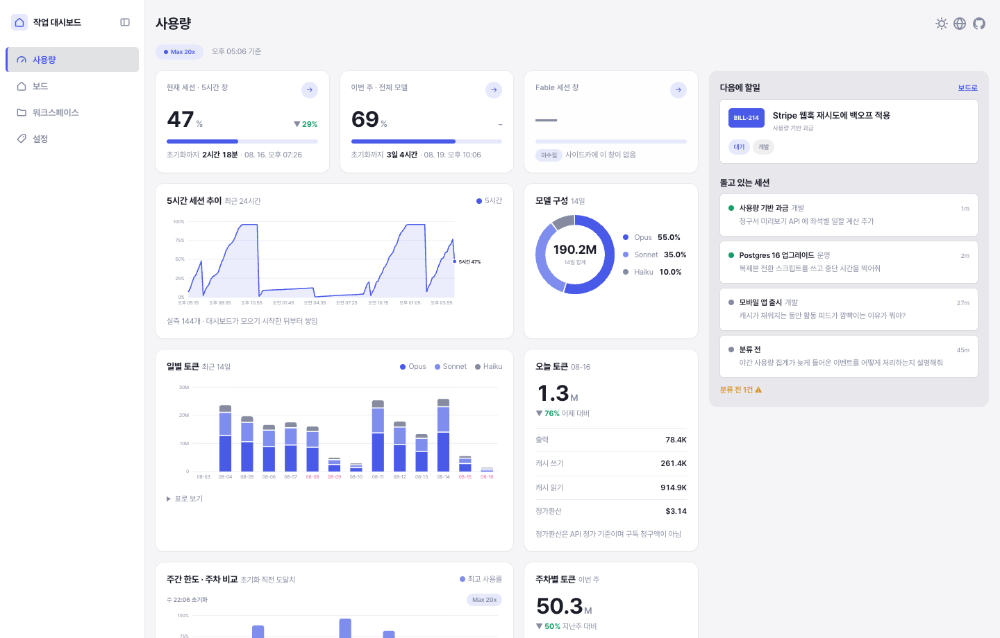

# 작업 대시보드

[English](../../README.md) · **한국어** · [日本語](../ja-JP/README.md) · [中文](../zh-CN/README.md)

Claude Code 와 함께 일하는 사람을 위한 로컬 작업 관리 도구. 사람은 브라우저로,
Claude 는 CLI 로 다루고, 둘이 같은 sqlite 파일을 읽고 쓴다. 프레임워크도, 번들러도,
`pip install` 도 없다.

작업은 **카테고리 → 워크스페이스 → 할일** 3계층으로 관리한다. 그 위에서 Claude Code
세션 하나하나가 등록되고 워크스페이스로 분류되며 실제로 작업 중인 할일에 연결된다.
그래서 보드는 지금 무엇이 돌고 있는지를 항상 보여주고, 다음 세션은 어디까지 진행됐는지
알고 시작한다.

> [!NOTE]
> 1인용이고 인증이 없으며 외부 서비스를 쓰지 않는다. 전부 내 PC 의 sqlite 파일 하나에
> 들어 있다.



할일 하나가 그 일을 하고 있는 세션과 워크트리를 거느린다. 훅이 프롬프트를 보낼 때
`working`, 멈출 때 `idle` 로 표시하므로, 나를 기다리는 세션이 아직 돌고 있는 세션처럼
보이지 않는다.



워크트리 하위 탭은 각 브랜치가 얼마나 벌어졌는지와 그 세션이 무엇을 하던 중이었는지를
보여주고, 케밥 메뉴에서 병합하거나 개발 서버를 띄운다.



사용량 화면은 로컬 Claude Code 로그를 읽어 한도 창과 일별 토큰·비용 추이를 그린다.

## 기능

- **3계층 보드** — 카테고리가 워크스페이스를 묶고, 워크스페이스가 할일을 담는다.
  우선순위는 순서만으로 표현하며, 전부 드래그로 재정렬한다.
- **세션 실시간 추적** — 훅이 Claude Code 세션을 등록하고 워크스페이스 컨텍스트를
  주입하며, 작업하는 동안 보드를 계속 맞춰 놓는다.
- **워크트리 관리** — 각 git 워크트리의 상태와 커밋을 보고, 그 워크트리의 개발 서버를
  보드에서 바로 실행·재실행·중지한다.
- **병합 한 커맨드** — 상태 확인 → 대상 브랜치 들이기 → 테스트 → 병합 → 할일·서버·
  브랜치 해제를 그 순서로 한다.
- **자율 실행** — 라벨이 붙은 할일 하나를 5분 크론으로 백그라운드 `claude` 잡에 맡긴다.
  기본은 꺼짐.
- **사용량 화면** — 로컬 Claude Code 로그에서 읽은 한도 창과 일별 토큰·비용 추이.
- **상태줄** — 지금 잡은 할일, 워크트리, 서버 포트를 Claude Code 상태줄에 그린다.
- **화면 언어 4종** — 영어(기본) · 한국어 · 일본어 · 중국어. 지구본 아이콘에서 바꾼다.
  서버가 만들어 내려주는 문구도 고른 언어를 따른다.
- **밝게·어둡게** — 해·달 아이콘에서 기기 설정 / 밝게 / 어둡게를 고른다. 계정이 아니라
  브라우저마다 남는다.

## 요구사항

| | |
| --- | --- |
| 필수 | Python 3.9+ (표준 라이브러리만), Git, 최신 브라우저 |
| 선택 | Claude Code — 세션 추적·상태줄·자율 실행에 필요 |
| 선택 | Node.js — 테스트 중 일부 화면 검증이 `node` 로 돈다 |
| 선택 | `PATH` 의 `markdownlint-cli2` — 마크다운 린트 훅이 쓴다 |
| 선택 | `ssl` 이 되는 Python — 구글 태스크 동기화에 필요. 같은 3.9 라도 빌드에 따라 빠져 있을 수 있으니 `python3 -c "import ssl"` 로 확인. `start.sh` 가 되는 것을 골라 띄우고, `WORK_DASHBOARD_PYTHON` 으로 지정할 수도 있다 |

## 빠른 시작

```bash
git clone https://github.com/yujung7768903/work-dashboard.git
cd work-dashboard
./start.sh
```

`http://127.0.0.1:9080` 을 연다. DB 는 최초 연결 때 만들어지므로 마이그레이션이나
초기 설치 단계가 없다.

```bash
./start.sh --port 9081     # 다른 포트. 예를 들어 워크트리용
./start.sh --lan           # 폰·아이패드에서도 열리게
./restart.sh               # 이 디렉토리에서 띄운 서버를 다시 시작
./stop.sh                  # 중지
./stop.sh --port 9081      # 그중 그 포트로 뜬 것만
python3 server.py          # 포그라운드로 실행
```

`start.sh` 는 인자를 `server.py` 로 그대로 넘기고 pid 와 로그 경로를 출력한다. 로그는
하루 한 파일(`logs/YYYY-MM-DD.log`)이고, 7일 넘게 손대지 않은 파일은 다음 실행 때
지운다.

`stop.sh` 와 `restart.sh` 는 이 디렉토리를 작업 위치로 쓰는 서버만 건드린다. 워크트리
서버와 메인 체크아웃 서버가 서로를 죽이지 않는다. 한 디렉토리에 서버가 여럿이면
`--port` 로 대상을 좁힌다.

`--lan` 은 `start.sh` 가 스스로 읽는 유일한 플래그다. `0.0.0.0` 에 바인딩하고, 다른
기기에 그대로 붙여넣을 수 있는 주소(`http://192.168.x.x:9080`)로 바꿔 찍는다 —
`server.py` 가 되돌려 찍는 `0.0.0.0` 이 아니라.

> [!WARNING]
> `--lan` 을 주면 같은 네트워크의 누구나 대시보드를 열 수 있다. 인증은 없다.

9080 은 메인 체크아웃 자리다. 늘 같은 주소여야 하기 때문이고, 워크트리는 9081 부터
쓴다. 워크트리 안에서 뜬 `server.py` 는 `--port 9080` 을 거절한다.

## 웹 화면

| 탭 | 내용 |
| --- | --- |
| 보드 | 전체 트리, 다음에 할 일, 돌고 있는 세션(2초 폴링) |
| 자율 수행 | ON/OFF 스위치, 후보 목록, 상태별로 묶인 실행 목록 |
| 워크스페이스 | 워크스페이스 생성과 배경·목적·목표·고려사항 편집 |
| 설정 | 카테고리와 라벨 |
| 사용량 | 한도 창과 토큰·비용 추이 |

보드에는 하위 탭이 셋 있다 — **할일**·**칸반**·**워크트리**. 칸반 하위 탭은 같은 할일을
상태(대기·진행중·완료) 컬럼으로 세우고, 컬럼 안에 워크스페이스 카드를, 카드 안에 그
워크스페이스의 그 상태 할일만 담는다. 워크트리 하위 탭에서는 각 줄의
케밥 메뉴(⋮)로 그 워크트리를 적용(병합)·삭제하고, 서버를 실행·재실행·중지한다. 이 탭은
워크스페이스별·프로젝트별로 묶어 볼 수 있고, 프로젝트별 보기는 어느 워크스페이스에도
안 걸린 워크트리까지 보여준다. 할일·워크트리 하위 탭은 카드를 1열·2열로 배치할 수 있고
(칸반은 컬럼 셋 고정), 좌측 레일은 아이콘만 남게 접힌다.

할일 줄과 세션 줄은 같은 팝업을 열고, 팝업은 탭 세 개다.

| 팝업 탭 | 내용 |
| --- | --- |
| 개요 | 제목, History, 착수 조건, 컨텍스트 노트 전문 |
| 세션 | 세션 id·위치·최근 대화 10건, 워크스페이스·카테고리 지정 |
| 워크트리 | 그 할일이 썼던 워크트리 — 상태·History·커밋 |

## CLI

`dash.py` 는 Claude Code 가 쓰는 진입점이다. 모든 명령이 웹과 같은 DB 를 보므로 한쪽의
변경은 다른 쪽에서 새로고침하면 보인다.

### 보드

```bash
python3 dash.py ls                                   # 전체 트리
python3 dash.py next                                 # 다음에 할 일 1건
python3 dash.py show <워크스페이스id|JIRA-1>           # 워크스페이스 상세
python3 dash.py add-category <이름>
python3 dash.py add-workspace <카테고리> <이름> [--background ...] [--jira KEY]
python3 dash.py add-todo <제목> [--workspace ID] [--note ...] [--precondition ...]
python3 dash.py move-todo <할일id> --workspace <id|none>
python3 dash.py set-status <todo|workspace> <id> <상태>
python3 dash.py reorder <categories|workspaces|todos> <ids...>
python3 dash.py done-today [--date YYYY-MM-DD]
```

### 세션

```bash
python3 dash.py sessions                             # 돌고 있는 세션
python3 dash.py classify --category <이름> [--workspace <id>]
python3 dash.py link-todo <할일id> [--status done] [--past]
python3 dash.py show-todo --session
python3 dash.py show-note <할일id>                    # 컨텍스트 노트 전문
```

`link-todo` 는 이 세션이 그 할일에 착수했다는 선언이고, 할일을 `doing` 으로 올린다.
실제로 하고 있는 것 하나만 연결한다 — `merge` 는 세션에 연결된 할일을 전부 닫으므로,
나중에 하려고 만들어 둔 후속 할일은 착수하는 세션이 연결할 때까지 연결하지 않는다.
`--past` 는 끝난 히스토리 세션을 연결하며 상태는 건드리지 않는다.

세션 인자는 생략할 수 있다. 생략하면 Claude Code 가 세션이 띄운 모든 프로세스에 넣어
주는 `CLAUDE_CODE_SESSION_ID` 로 자기 세션을 찾는다.

### 워크트리와 병합

```bash
python3 dash.py merge                        # 확인 → 대상 들이기 → 테스트 → 병합 → 해제
python3 dash.py merge --message "제목"        # 병합 커밋 제목
python3 dash.py merge --test "npm test"      # tests/__main__.py 가 없는 저장소
python3 dash.py merge --no-test
python3 dash.py finish [--worktree PATH]     # 해제만 — 할일 done + 서버 종료
python3 dash.py statusline <세션> [--cwd PATH]
```

`merge` 는 대상 브랜치를 워크트리에 들인 뒤에 테스트를 **한 번만** 돌린다. 테스트한
트리가 곧 병합될 트리다. 충돌로 멈추면 파일을 해결하고 `git add` 한 뒤 같은 명령을
다시 실행하면 이어받는다. push 는 하지 않고, 워크트리도 지우지 않는다 —
`ExitWorktree` 몫이다.

### 초기 설정·언어·자율 실행

```bash
python3 dash.py onboard [--skip]             # 초기 설정이 필요한 상태인지
python3 dash.py scan-history --days 7        # 지난 세션당 한 줄 요약
python3 dash.py language [en|ko|ja|zh]       # 인자가 없으면 현재 값
python3 dash.py usage                        # 한도 사용률과 토큰 추이
python3 dash.py autorun on|off|status
python3 dash.py autorun-tick [--dry-run]     # 5분 크론이 부르는 진입점
python3 dash.py autorun-prompt <할일id>       # 자율 세션에 실제로 들어가는 지시 전문
python3 dash.py autorun-request "<이유>"      # 판단 보류 — 사람 결정을 요청
python3 dash.py autorun-finish               # 완료 — 검토 대기로
```

## Claude Code 연동

### 세션 컨텍스트

훅은 세션마다 `<work-dashboard state="...">` 블록을 **하나만** 주입한다. 어떤 것이
들어가는지는 보드 상태에 달렸다.

| 상태 | 조건 | 주입 내용 |
| --- | --- | --- |
| `classified` | 브랜치의 Jira ID 로 매칭됐거나 `classify --workspace` 로 붙은 워크스페이스가 있음 | 배경·목적·목표·고려사항, 할일 목록, 범위 준수 지침 |
| `onboarding` | 워크스페이스가 하나도 없고 사용자가 거절한 적도 없음 | 초기 설정 절차 |
| `unclassified` | 그 외 | 현재 위치·브랜치, 카테고리, 진행 중 워크스페이스, 분류 절차 |
| `released` | 이 세션이 잡은 할일이 전부 `done` | 새 요청은 끝난 할일에 얹지 말고 새 할일로 받으라는 지시 |

분류 자체는 자동이 아니다 — 셸은 질문이 무엇에 관한 것인지 알 수 없다. 훅은 지시만
주입하고, Claude 가 `classify` 와 `link-todo` 로 직접 등록한다.

### 훅

모든 훅은 어떤 실패에서도 조용히 `exit 0` 으로 끝난다. 대시보드 문제로 세션이 안
열리거나 파일을 못 고치게 되는 일은 없어야 한다. `exit 2` 는 막는 것이 목적일 때만
쓴다.

| 훅 | 이벤트 | 하는 일 |
| --- | --- | --- |
| `hooks/dash_hook.py` | `SessionStart`, `UserPromptSubmit`, `Stop`, `SessionEnd` | 세션 등록·상태 추적과 위 컨텍스트 블록 주입 |
| `hooks/worktree_serve.py` | `Stop` | 고친 워크트리에 서비스 중인 서버가 없으면 막고 빈 포트(9081–9139)를 건네준다 |
| `hooks/worktree_guard.py` | `PreToolUse` (`Write`·`Edit`·`NotebookEdit`) | `~/work/` 메인 체크아웃의 소스 편집을 막는다. `ALLOW_MAIN_CHECKOUT=1` 로 우회 |
| `hooks/commit_scope_guard.py` | `PreToolUse` (`Bash`) | pathspec 없는 `git add -A`·`git commit -a` 를 막는다. `ALLOW_BROAD_COMMIT=1` 로 우회 |
| `hooks/md_lint.py` | `PostToolUse` (`Write`·`Edit`·`NotebookEdit`) | 이 저장소에 저장된 `.md` 를 `markdownlint-cli2` 로 검사 |
| `hooks/stale_base.py` | `UserPromptSubmit` | 브랜치가 upstream 또는 기준 브랜치보다 뒤처졌으면 세션당 한 번 경고 |

`worktree_serve.py` 는 이 저장소의 `.claude/settings.json` 에 이미 등록돼 있어 새로
clone 해도 따로 할 일이 없다. 나머지 다섯은 `~/.claude/settings.json` 에 절대 경로로
등록한다. 경로는 워크트리가 아니라 메인 체크아웃을 가리켜야 한다 — 워크트리는 병합
뒤 지워진다.

```json
{
  "hooks": [
    {
      "type": "command",
      "command": "python3 /절대경로/work-dashboard/hooks/dash_hook.py SessionStart",
      "timeout": 2
    }
  ]
}
```

`dash_hook.py` 는 이벤트 이름을 유일한 인자로 받으므로, 마지막 인자만 바꿔 이벤트마다
하나씩 추가한다.

### 상태줄

`~/.claude/statusline-command.js` 가 `dash.py statusline <세션> --cwd <경로>` 를 부르고
그 출력을 사용률 막대 아래 둘째 줄에 그린다.

```text
Context ████░░░░░░ 42% │ Usage ███░░░░░░░ 30% │ Weekly ██████░░░░ 55%
[doing | tab-underline | :9092] 보드에 할일·워크트리 탭 분리하고 워크트리 뷰 추가
```

대괄호 안은 항상 **상태 | 워크트리 | 포트** 순서이고, 없는 칸은 구분자까지 같이 빠진다.
셋 다 없으면 대괄호 자체가 없다.

### 자율 실행

`autorun on` 이면 5분 크론이 할일 하나를 골라 백그라운드 `claude` 잡으로 돌린다.
`auto` 라벨이 붙은 할일만 대상이다 — 자율 실행 허가는 사람이 주는 것이지 코드가
추정할 것이 아니다. 기본은 꺼짐이고 자동으로 다시 켜지는 경로는 없다.

```cron
*/5 * * * * /usr/bin/python3 /절대경로/work-dashboard/dash.py autorun-tick >/dev/null 2>&1
```

대상이 없는 tick 은 아무것도 하지 않는다. 데몬이 아니라 크론인 이유다.

**자율 수행** 탭에 스위치와 목록 둘이 있다. 후보는 `auto` 라벨이 붙은 할일을 순위대로
늘어놓고 줄마다 지금 못 도는 이유를 칩으로 붙인다 — 돌 수 있는 것만 보여주면 목록이
늘 비어 왜 안 도는지를 알 수 없다. 손잡이를 잡아 끌면 순서가 `todos.autorun_order` 에
저장되고 tick 도 그 순서로 고른다. 목록 맨 위와 실제로 돌 할일이 다르면 그 조작이
거짓말이 된다. 실행 목록은 확인 필요 · 진행 중 · 막힘/실패 · 완료로 묶이고 사람이
처리할 구획은 펼친 채로 둔다.

착수 조건이 있는 할일은 코드가 항목을 전부 판정할 수 있고 전부 충족일 때만 후보가
된다. `#id` 줄은 그 할일 상태로 판정하고, `확인:` 명령이나 자연어 문장은 판정할 수
없어 사람이 풀 때까지 후보에서 빠진다. 확인 명령은 상세 팝업의 `확인` 버튼으로만
돈다 — `POST /api/precondition-check` 는 `{todo_id, index}` 만 받고 무엇을 돌릴지는
저장된 조건 문장에서 서버가 다시 읽는다.

## 구글 태스크 양방향 동기화

폰에서 할일을 보고 체크하려고 붙였다. 구글이 1단계 중첩만 허용하므로 세 층이 그대로
들어맞는다.

```text
구글 목록        =  카테고리
 └ 최상위 태스크  =  워크스페이스
    └ 하위 태스크 =  그 워크스페이스의 할일
```

목록 이름은 카테고리 이름 **그대로**다. 접두어를 붙이면 폰에서 손으로 만든 목록이 영영
안 붙어 같은 이름이 둘씩 생긴다.

구조는 양방향으로 그대로 오간다. **폰에서 만든 최상위는 워크스페이스가 되고, 그 하위는
그 워크스페이스의 할일이 된다.** 워크스페이스가 없는 할일도 최상위로 올라가지만, 올린 뒤
링크가 남으므로 다음 회차에 "이미 짝이 있는 것"으로 걸러진다 — **짝 없는 최상위만**
워크스페이스로 받기 때문에 회차마다 늘어나지 않는다.

### 최초 1회 설정

**터미널을 안 쓰고 화면에서 끝낼 수 있다.** 설정 탭의 `연결하기` 를 누르면 자격증명을
어디서 받는지 단계로 안내하고, 받아 온 두 값을 입력받아
`~/.claude/work-dashboard/gtasks.json` (권한 600) 에 저장한 뒤 동의 창까지 연다. 입력한
값은 동의가 실패해도 남으므로 다시 타이핑하지 않는다.

안내가 시키는 것은 이렇다. [Google Cloud Console](https://console.cloud.google.com/)에서
프로젝트를 만들어 **Google Tasks API** 를 켜고, **사용자 인증 정보 → OAuth 클라이언트
ID → 데스크톱 앱** 으로 클라이언트를 만든다.

터미널로 하려면 아래처럼 한다. 자격증명은 **인자 > 환경변수 > `gtasks.json`** 순으로
찾는다.

```bash
# (a) 환경변수 — 셸 히스토리에 secret 이 남지 않는다
GTASKS_CLIENT_ID=<ID> GTASKS_CLIENT_SECRET=<SECRET> python3 dash.py gtasks-auth

# (b) 파일에 미리 적어 두면 이 명령은 인자가 필요 없다
cat > ~/.claude/work-dashboard/gtasks.json <<'EOF'
{ "client_id": "<ID>", "client_secret": "<SECRET>" }
EOF
chmod 600 ~/.claude/work-dashboard/gtasks.json
python3 dash.py gtasks-auth

# (c) 플래그 — 히스토리에 남으므로 권하지 않는다
python3 dash.py gtasks-auth --client-id <ID> --client-secret <SECRET>
```

승인이 끝나면 같은 파일에 `refresh_token` 이 더해져 세 키가 된다. **`refresh_token` 은
손으로 적어 넣을 수 없다** — 구글 동의 화면을 거쳐야만 발급된다. 다른 데서 이미 받아 둔
것이 있다면 세 키를 직접 써넣고 `gtasks-auth` 를 건너뛰어도 된다. 브라우저가 자동으로 안
열리는 환경(헤드리스·기본 브라우저 미설정)이면 기다리지 않고 승인 주소를 화면에 돌려준다.

### 설정 화면

인증만으로는 아직 아무것도 안 돈다. **켜기 전에 카테고리부터 맞춘다.**

1. `연결하기` — 인증이 없을 때만 뜬다. 이미 받아 둔 자격증명이 있으면 안내와 입력을
   건너뛴다
2. `카테고리 맞추기` — 양쪽 목록을 읽어 **고를 수 있는 후보를 체크박스로, 양쪽 건수와
   함께** 보여준다. 세 무리로 나뉜다: 양쪽에 있음(고르면 합쳐짐) / 대시보드에만 /
   구글에만
3. `연동 시작` — **고른 것만** 반대쪽에 만들고 링크하고 켠다. 고르지 않은 것은 **양쪽
   어디에도 만들지 않는다**. 할일 동기화는 여기서 하지 않는다
4. 그 뒤에야 마스터 ON/OFF 스위치와 카테고리별 on/off 가 뜬다. **카테고리는 전부 꺼진
   채로 시작한다** — 목록을 맞추는 것과 할일을 주고받는 것은 다른 결정이고, 켜진 채로
   시작하면 첫 동기화가 전 카테고리의 할일을 한꺼번에 폰으로 올린다. 마스터를 끄면 **값은
   그대로 둔 채** 회색으로 잠근다

**건수를 같이 보여주는 것이 핵심이다.** 이름이 같다고 같은 것이 아니다 — 대시보드
`공부`(할일 2개)와 폰의 `공부`(61개)가 별개인데 이름만 보고 켜면 두 뭉치가 한 번에
합쳐진다. 되돌릴 방법이 없으므로 고르기 전에 양쪽 크기를 보여준다.

고르기 팝업은 **2번 한 번뿐**이다. 그 뒤로 마스터를 껐다 켜는 것은 스위치 하나로 끝난다 —
이미 맞춰 둔 목록을 켤 때마다 다시 확인받을 이유가 없다. 맞추기 전에는 켤 것이 없으므로
스위치 자체를 감춘다. 맞춘 뒤에 구글 목록을 더 가져오려면 `카테고리 가져오기` 를
누른다 — 이미 연동된 항목은 잠긴 채로 보인다.

`연결 해제` 는 구글 **계정 승인만** 버린다. 양쪽 할일도, 카테고리 링크도,
`client_id`/`client_secret` 도 그대로 남아 다시 연결하면 이어서 동기화된다. 대신
`meta.gtasks_seen_ids` 는 비운다 — 그게 남아 있으면 다시 붙였을 때 그 사이 사라진 태스크를
'폰에서 지웠다'로 읽어 멀쩡한 할일을 지운다.

문제가 생겨도 **연동을 자동으로 끄지 않는다.** 와이파이가 한 번 끊겼다고 설정이 꺼지면
사용자가 그 사실을 모른 채 며칠을 보낸다. 대신 제목 오른쪽에 `⚠ 로그인 만료` 처럼 사유만
띄운다. 끄는 판단은 사람이 한다. 사유는 마지막 동기화가 `gtasks_state.last_error` 에 남긴
것을 읽는다 — 설정 탭을 열 때마다 구글에 물어보지 않는다.

### 동기화

**`gtasks-sync` 는 인자가 없다.** 자격증명은 위 1회로 끝이고, 이후로는 저장된
`refresh_token` 으로 access token 을 알아서 받아 쓴다. **연동이 꺼져 있으면 아무것도 하지
않고 끝난다** — cron 이 매번 부르는 자리라 실패로 처리하지 않는다.

```bash
python3 dash.py gtasks-sync --dry-run   # 무엇이 바뀔지만 보고 아무것도 안 씀
python3 dash.py gtasks-sync
```

**첫 실행은 `--dry-run` 으로 확인한다** — 미완료 할일 전부가 구글에 생성된다.

웹훅이 없는 API라 주기적으로 부르는 것 말고 방법이 없다. **기본으로 등록되는 자동 실행은
없다** — 걸어 두지 않으면 `지금 동기화` 를 누를 때만 돈다. 설정 화면은 이 상태를 그대로
보여준다(`자동 실행 없음 | 아직 동기화한 적 없음`). 주기를 상수로 적지 않고
`launchd`(`~/Library/LaunchAgents/*.plist` 의 `StartInterval`)와 `crontab -l` 에서
`gtasks-sync` 를 찾아 읽는다 — 안 걸어 둔 사람에게 "10분마다" 라고 적으면 거짓말이 되기
때문이다.

```bash
# 10분마다. crontab -e
*/10 * * * * cd ~/work/work-dashboard && /usr/bin/python3 dash.py gtasks-sync >> /tmp/gtasks.log 2>&1
```

### 동기화 규칙

| 항목 | 방향 | 충돌 시 |
| --- | --- | --- |
| 제목 | 양방향 | `updated_at` vs `updated` 최신 우선 |
| 완료 여부 | 양방향 | 위와 같음 |
| note·착수 조건 | 내려보내기만 | 폰에서 고쳐도 대시보드는 안 바뀜 |
| 워크스페이스 배경·목적·목표·고려사항 | 내려보내기만 | `notes` 한 칸에 네 줄로 실린다 |
| 라벨 | 동기화 안 함 | — |

- **내용이 실제로 다를 때만** 시각을 본다. 안 그러면 우리가 방금 민 것 때문에 원격이 늘
  최신이라 무한 왕복이 된다.
- 시각은 초 단위로 잘라서 비교한다. `db.now()` 는 초까지만 적고 구글은 밀리초까지 주므로,
  그대로 두면 같은 초에 고친 로컬 수정이 조용히 되돌려진다.
- 동점이면 로컬이 이긴다.
- 폰의 완료를 받다가 로컬 규칙(자율 실행 검토 대기 등)에 막히면 **건너뛰고 보고**한다.
  로컬 규칙이 이긴다.
- 폰에는 `todo`/`doing` 구분이 없다. 폰에서 완료를 풀면 `doing` 이었어도 `todo` 로
  내려온다. 워크스페이스도 마찬가지로 `inactive` 가 아니라 `active` 로 돌아온다.
- 카테고리 스위치를 끄면 그 카테고리는 통째로 건너뛴다. 목록 링크는 남으므로 다시 켜도
  목록이 새로 생기지 않는다.

### 삭제

`meta.gtasks_seen_ids` 에 지난 회차의 태스크 id 를 남겨 두는 것이 "폰에서 새로 만든 것"과
"대시보드에서 지운 것"을 가르는 유일한 근거다.

| 상황 | 처리 |
| --- | --- |
| 대시보드에서 지움 | 구글에서도 지움 |
| 폰에서 지움 (미완료) | 대시보드에서도 지움 |
| 폰에서 지움 (완료) | 그대로 둠 — '완료 항목 삭제'가 무덤을 파헤치면 안 되므로 |

완료분은 링크도 남겨 둔다. 링크를 지우면 다음 회차가 "아직 안 올린 것"으로 보고 무덤을
다시 파낸다.

지우려면 **지난 회차에 봤다는 증거**(`gtasks_seen_ids`)가 있어야 한다. 링크가 있는데 본
적이 없으면 목록이나 계정이 바뀐 것이므로 지우지 않고 다시 올린다 — 이 조건이 없으면 다른
계정으로 갈아탄 순간 모든 링크가 한꺼번에 낯설어져 미완료 할일이 전멸한다.

**워크스페이스를 지울 때가 까다롭다.** 구글은 최상위를 지우면 하위까지 함께 지우는데,
대시보드에서는 소속 할일이 미분류로 살아남는다. 그 할일들의 링크를 그대로 두면 다음 회차가
"폰에서 지웠다"로 읽어 멀쩡한 할일을 지운다. 그래서 최상위를 지우기 전에 함께 사라질
하위의 링크를 끊고, 같은 회차에 최상위 태스크로 다시 올린다.

## 설정

| 항목 | 위치 |
| --- | --- |
| DB | `~/.claude/work-dashboard/dash.db`. `WORK_DASHBOARD_DB` 로 덮어쓴다 |
| 호스트·포트 | `server.py --host` / `--port` (기본 `127.0.0.1:9080`) |
| 화면 언어 | 지구본 아이콘 또는 `dash.py language`. `meta.language` 에 저장 |
| 화면 취향 | 밝기·보드 열 수·레일 접힘 — 브라우저의 `localStorage` 에 저장 |
| 화면 문구 | `static/lang/{en,ko,ja,zh}.json`. 키가 서로 같고 영어가 폴백 |
| 디자인 토큰 | `static/css/app.css` 의 `:root` — 간격·글자·둥글기의 유일한 출처 |
| 마크다운 규칙 | `.markdownlint.json` |

## 데이터 모델

sqlite 를 웹 서버·CLI·훅이 직접 연다. 중재하는 프로세스는 없다. `connect()` 가 스키마를
만들고 외래키와 WAL 을 켜며 기본 카테고리 6개를 최초 1회만 시드한다. `*_at` 컬럼은
전부 ISO 8601 UTC 텍스트다.

| 테이블 | 역할 |
| --- | --- |
| `categories` | 최상위 그룹핑. 우선순위에는 관여하지 않는다. `google_list_id` 가 구글 목록을, `gtasks_enabled` 가 카테고리별 동기화 on/off(기본 꺼짐)를 담는다 |
| `workspaces` | 브랜치·Jira 단위 작업. 배경·목적·목표·고려사항을 보관. `google_task_id` 로 구글 최상위 태스크와 이어진다 |
| `todos` | 할일. 워크스페이스에 속하거나 카테고리 직속일 수 있다. `google_task_id` 로 구글 하위 태스크와 이어진다 |
| `labels`, `todo_labels` | 라벨은 할일의 성격이라 한 할일에 여럿 붙는다 |
| `sessions` | Claude Code 세션. 훅이 등록·갱신한다 |
| `session_todos` | 세션이 잡은 할일. 세션의 워크스페이스는 여기서 파생한다 |
| `worktrees` | 워크트리 이력. 병합·삭제로 디렉토리가 사라져도 남는다 |
| `usage_samples` | 사용량 화면이 쓰는 한도·토큰 샘플 |
| `autorun_state`, `autorun_runs` | 자율 실행 설정과 실행 기록 |
| `gtasks_state` | 구글 태스크 연동 설정 — `enabled`, `last_sync_at`, `last_error`. `autorun_state` 와 같은 이유로 단일 행 |
| `meta` | 단일 설정과 내부 플래그. `gtasks_seen_ids` 도 여기 |

## 프로젝트 구조

```text
work-dashboard/
├── dash.py               # CLI 진입점 — 파싱·위임·출력만
├── server.py             # HTTP 진입점 (http.server, 프레임워크 없음)
├── start.sh              # 백그라운드 실행, 날짜별 로그, 7일치 정리
├── stop.sh · restart.sh  # 이 디렉토리의 서버만 다룬다
├── serving.sh            # 서버 탐지·종료 공용 함수
├── app/
│   ├── constants.py      # 매직넘버는 전부 여기로
│   ├── db.py             # 연결·스키마·트랜잭션
│   ├── repositories/     # 엔티티별 저장·조회와 정합성 규칙
│   └── services/         # 여러 엔티티에 걸치는 로직
├── hooks/                # Claude Code 훅
├── static/               # ES 모듈 프론트엔드 (번들러 없음)
│   ├── index.html        # 단일 페이지. 문구 대신 data-i18n 키만 갖는다
│   ├── lang/             # en · ko · ja · zh, 키 집합이 같다
│   ├── css/              # app.css 가 토큰을 정의하고 usage.css 는 참조만
│   └── js/               # boot·i18n·theme·layout·board·workspace·sessions·usage
├── tests/                # python3 -m tests
└── docs/superpowers/     # 설계 문서와 계획
```

## 테스트

```bash
python3 -m tests
```

리포지토리·서비스·CLI·훅을 덮고, 네 언어 파일의 키와 자리표시자가 일치하는지 보며,
CSS 의 간격·글자가 생 px 이 아니라 디자인 토큰을 쓰는지 강제한다. 화면 동작 검증은
`node` 로 돌고 같은 이름의 파이썬 테스트가 부른다. `start.sh` 같은 스크립트를 실제로
실행해 보는 테스트는 9900–9999 포트에 서버를 띄우며, 이 대역은 화면에 그리지 않는다.

## 설계 문서

`docs/superpowers/specs/` 에 단계별 설계와 확정 결정이, `docs/superpowers/plans/` 에
구현 계획이 있다.
