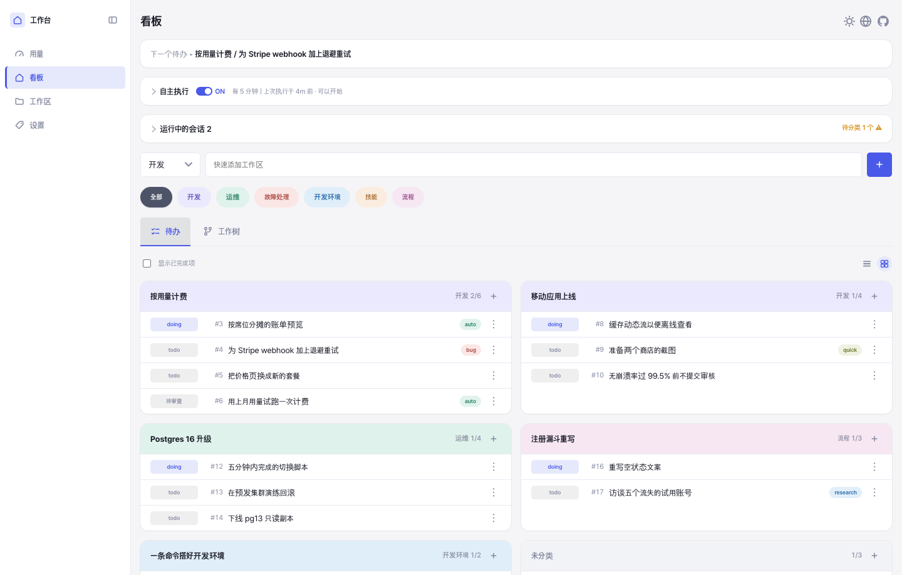
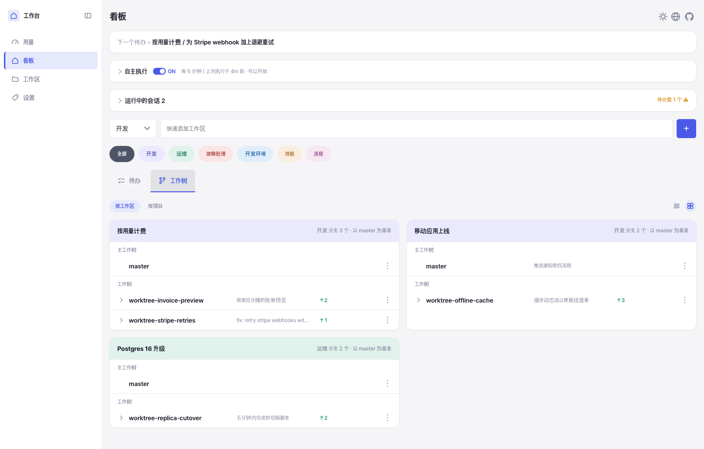
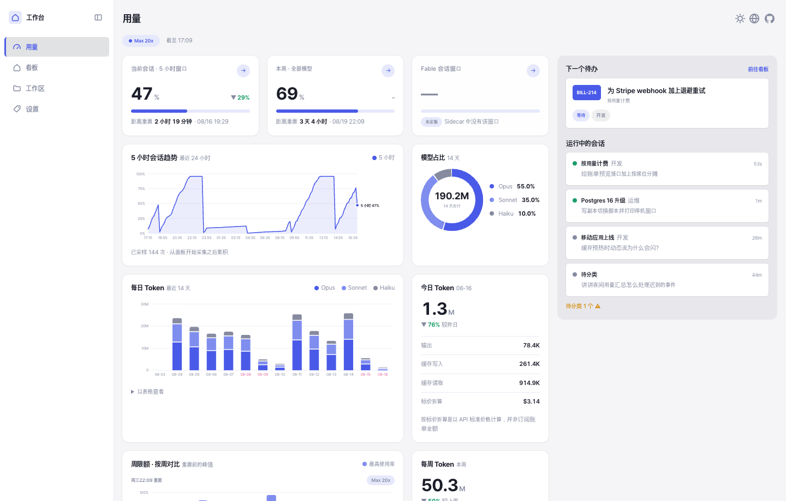

# 工作看板

[English](../../README.md) · [한국어](../ko-KR/README.md) · [日本語](../ja-JP/README.md) · **中文**

一个面向「与 Claude Code 搭档工作」的本地任务管理工具。人从浏览器操作，Claude 从 CLI
操作，两边读写同一个 SQLite 文件。没有框架，没有打包器，也不需要 `pip install`。

工作按 **分类 → 工作区 → 待办** 三层组织。在此之上，每个 Claude Code 会话都会被注册、
归入某个工作区，并关联到它实际正在处理的待办。因此看板始终显示当前在跑什么，下一个会话
也能在了解进度的前提下开始。

> [!NOTE]
> 单人使用，无鉴权，不依赖任何外部服务。所有数据都在本机的一个 SQLite 文件里。



一个待办带着正在做它的会话和工作树。钩子会在你发出提示时记为 `working`，停下时记为
`idle`，所以在等你回话的会话不会看起来跟还在忙的一样。



工作树子标签页显示每个分支偏离了多少、那个会话当时在做什么，右侧菜单可以合并分支或
启动它的开发服务器。



用量视图读取本地 Claude Code 日志，画出限额窗口和每日 token 与费用趋势。

## 功能

- **三层看板** —— 分类归拢工作区，工作区容纳待办。优先级只用顺序表达，且全部支持拖拽
  排序。
- **会话实时追踪** —— 钩子注册每个 Claude Code 会话，注入其工作区上下文，并在工作过程中
  持续同步看板。
- **工作树管理** —— 查看每个 git 工作树的状态与提交，并直接从看板启动、重启或停止它的
  开发服务器。
- **一条命令完成合并** —— 状态检查 → 拉入目标分支 → 跑测试 → 合并 → 释放待办、服务器与
  分支，严格按此顺序。
- **自主执行** —— 把带标签的一条待办交给五分钟 cron 拉起的后台 `claude` 任务。默认关闭。
- **用量视图** —— 从本地 Claude Code 日志读取的限额窗口，以及每日 token 与费用趋势。
- **状态栏** —— 把当前待办、工作树和服务器端口渲染进 Claude Code 状态栏。
- **四种界面语言** —— 英语(默认)、韩语、日语、中文，点击地球图标切换。服务器返回的
  提示语也跟随所选语言。
- **浅色与深色** —— 点击日月图标在跟随系统 / 浅色 / 深色之间选择。它记在浏览器里，
  而不是账号里。

## 环境要求

| | |
| --- | --- |
| 必需 | Python 3.9+(仅标准库)、Git、现代浏览器 |
| 可选 | Claude Code —— 会话追踪、状态栏与自主执行需要 |
| 可选 | Node.js —— 测试中的部分界面检查在 `node` 下运行 |
| 可选 | `PATH` 中的 `markdownlint-cli2` —— Markdown lint 钩子会用到 |
| 可选 | 带 `ssl` 的 Python —— Google 任务同步需要。同为 3.9 也可能因构建方式而缺失，用 `python3 -c "import ssl"` 确认。`start.sh` 会自动选择可用的解释器，也可用 `WORK_DASHBOARD_PYTHON` 指定 |

## 快速开始

```bash
git clone https://github.com/yujung7768903/work-dashboard.git
cd work-dashboard
./start.sh
```

然后打开 `http://127.0.0.1:9080`。数据库在首次连接时创建，因此没有迁移或初始化步骤。

```bash
./start.sh --port 9081     # 换个端口，例如给工作树用
./start.sh --lan           # 让手机、平板也能打开
./restart.sh               # 重启由本目录启动的服务器
./stop.sh                  # 停止
./stop.sh --port 9081      # 只停在该端口上的那个
python3 server.py          # 改为前台运行
```

`start.sh` 会把参数原样传给 `server.py`，并打印 pid 和日志路径。日志按天一个文件
(`logs/YYYY-MM-DD.log`)，超过七天未被写入的文件会在下次启动时清理。

`stop.sh` 与 `restart.sh` 只作用于以本目录为工作目录的服务器，因此工作树的服务器和主
检出的服务器不会互相误杀。同一个目录里跑着多个时，用 `--port` 把范围收窄到一个。

`--lan` 是 `start.sh` 自己解析的唯一参数：它绑定到 `0.0.0.0`，并打印其他设备可以直接
粘贴的地址(`http://192.168.x.x:9080`)，而不是 `server.py` 原样回显的 `0.0.0.0`。

> [!WARNING]
> 加上 `--lan` 后，同一网络里的任何人都能打开看板，而且没有任何鉴权。

9080 是主检出的位置，为的是它始终是同一个地址；工作树从 9081 起用。在工作树里启动的
`server.py` 会拒绝 `--port 9080`。

## 网页界面

| 标签页 | 内容 |
| --- | --- |
| 看板 | 完整树、下一件待办、正在运行的会话(每 2 秒轮询) |
| 自动执行 | 开关、候选列表、按状态分组的执行列表 |
| 工作区 | 创建工作区，编辑背景、目的、目标与注意事项 |
| 设置 | 分类与标签 |
| 用量 | 限额窗口与 token、费用趋势 |

看板下有三个子标签：**待办**、**状态看板** 和 **工作树**。状态看板子标签把同样的待办
按与待办行相同的四个状态(等待·进行中·待审查·完成)分成列。一个待办就是一张卡片，属于
哪个工作区写在标题上方的小行里。卡片高度一致，超过两行的标题用省略号截断。
在工作树子标签里，每行的更多菜单(⋮)可以
应用(合并)或删除该工作树，并启动、重启、停止它的服务器。该子标签可以按工作区或按项目
分组，按项目的视图还会列出不属于任何工作区的工作树。待办和工作树子标签能把卡片排成
一列或两列(状态看板固定四列)，左侧导航栏也可以折叠成图标。

待办行与会话行打开的是同一个弹窗，弹窗分为三个标签页。

| 弹窗标签页 | 内容 |
| --- | --- |
| 概览 | 标题、历史、开工条件与上下文备注全文 |
| 会话 | 会话 id、位置、最近 10 条往来，以及工作区/分类的指定 |
| 工作树 | 该待办用过的工作树 —— 状态、历史与提交 |

## 命令行

`dash.py` 是 Claude Code 使用的入口。所有命令与网页共用同一个数据库，一边的改动在另一边
刷新后即可看到。

### 看板

```bash
python3 dash.py ls                                   # 完整树
python3 dash.py next                                 # 下一件待办
python3 dash.py show <工作区id|JIRA-1>                # 工作区详情
python3 dash.py add-category <名称>
python3 dash.py add-workspace <分类> <名称> [--background ...] [--jira KEY]
python3 dash.py add-todo <标题> [--workspace ID] [--note ...] [--precondition ...]
python3 dash.py move-todo <待办id> --workspace <id|none>
python3 dash.py set-status <todo|workspace> <id> <状态>
python3 dash.py reorder <categories|workspaces|todos> <ids...>
python3 dash.py done-today [--date YYYY-MM-DD]
```

### 会话

```bash
python3 dash.py sessions                             # 正在运行的会话
python3 dash.py classify --category <名称> [--workspace <id>]
python3 dash.py link-todo <待办id> [--status done] [--past]
python3 dash.py show-todo --session
python3 dash.py show-note <待办id>                    # 上下文备注全文
```

`link-todo` 是"本会话已着手这条待办"的声明，会把它推进到 `doing`。只关联真正在做的
那一条 —— `merge` 会关闭所有与该会话关联的待办，因此为以后准备的后续待办先不关联，
等真正着手的会话去关联。`--past` 用于关联已结束的历史会话，不改动待办状态。

会话参数可以省略：省略时 CLI 会退回到 `CLAUDE_CODE_SESSION_ID`，这是 Claude Code 为会话
派生的每个进程都设置的变量。

### 工作树与合并

```bash
python3 dash.py merge                        # 检查 → 拉入目标 → 测试 → 合并 → 释放
python3 dash.py merge --message "标题"        # 合并提交标题
python3 dash.py merge --test "npm test"      # 没有 tests/__main__.py 的仓库
python3 dash.py merge --no-test
python3 dash.py finish [--worktree PATH]     # 仅释放 —— 待办置为 done、停掉服务器
python3 dash.py statusline <会话> [--cwd PATH]
```

`merge` 会在把目标分支拉进工作树之后 **只跑一次** 测试，被测的那棵树就是将被合并的那棵。
如果因冲突中断，解决文件后 `git add`，再执行同一条命令即可接着走。它不会 push，也不会
删除工作树 —— 那是 `ExitWorktree` 的职责。

### 初始设置、语言与自主执行

```bash
python3 dash.py onboard [--skip]             # 是否仍需初始设置
python3 dash.py scan-history --days 7        # 过去每个会话一行摘要
python3 dash.py language [en|ko|ja|zh]       # 不带参数则打印当前值
python3 dash.py usage                        # 限额使用率与 token 趋势
python3 dash.py autorun on|off|status
python3 dash.py autorun-tick [--dry-run]     # 五分钟 cron 调用的入口
python3 dash.py autorun-prompt <待办id>       # 自主会话实际收到的指令全文
python3 dash.py autorun-request "<原因>"      # 暂缓判断，请人来决定
python3 dash.py autorun-finish               # 完成 —— 转入待复核
```

## 与 Claude Code 的集成

### 会话上下文

钩子每个会话只注入 **一个** `<work-dashboard state="...">` 块，注入哪一个取决于看板状态。

| 状态 | 条件 | 注入内容 |
| --- | --- | --- |
| `classified` | 已有工作区，通过分支的 Jira ID 匹配或用 `classify --workspace` 指定 | 背景、目的、目标、注意事项、待办列表与范围约束 |
| `onboarding` | 一个工作区都还没有，且用户也没有拒绝过 | 初始设置流程 |
| `unclassified` | 其余情况 | 当前位置与分支、分类、进行中的工作区，以及分类步骤 |
| `released` | 本会话认领的待办全部为 `done` | 提示把新请求作为新待办接收，而不是压在已完成的待办上 |

分类本身不是自动的 —— shell 无法判断一个问题是关于什么的。钩子只注入指令，由 Claude 用
`classify` 和 `link-todo` 完成登记。

### 钩子

所有钩子在任何失败下都静默 `exit 0`。绝不能因为看板出问题而导致会话打不开或文件改不了。
`exit 2` 只用在「拦截本身就是目的」的场景。

| 钩子 | 事件 | 作用 |
| --- | --- | --- |
| `hooks/dash_hook.py` | `SessionStart`、`UserPromptSubmit`、`Stop`、`SessionEnd` | 注册会话、追踪状态，并注入上面的上下文块 |
| `hooks/worktree_serve.py` | `Stop` | 改过的工作树若没有服务器在跑，则拦截并给出一个空闲端口(9081–9139) |
| `hooks/worktree_guard.py` | `PreToolUse`(`Write`、`Edit`、`NotebookEdit`) | 拦截 `~/work/` 主检出中的源码编辑。`ALLOW_MAIN_CHECKOUT=1` 可绕过 |
| `hooks/commit_scope_guard.py` | `PreToolUse`(`Bash`) | 拦截不带 pathspec 的 `git add -A` 与 `git commit -a`。`ALLOW_BROAD_COMMIT=1` 可绕过 |
| `hooks/md_lint.py` | `PostToolUse`(`Write`、`Edit`、`NotebookEdit`) | 用 `markdownlint-cli2` 检查本仓库中保存的 `.md` |
| `hooks/stale_base.py` | `UserPromptSubmit` | 当分支落后于 upstream 或基准分支时，每个会话提醒一次 |

`worktree_serve.py` 已经登记在本仓库的 `.claude/settings.json` 里，新克隆无需额外配置。
其余五个请以绝对路径登记到 `~/.claude/settings.json`，且路径要指向主检出而不是工作树
—— 工作树在合并后会被删除。

```json
{
  "hooks": [
    {
      "type": "command",
      "command": "python3 /绝对路径/work-dashboard/hooks/dash_hook.py SessionStart",
      "timeout": 2
    }
  ]
}
```

`dash_hook.py` 只接收事件名这一个参数，所以每个事件各加一条，只改最后那个参数即可。

### 状态栏

`~/.claude/statusline-command.js` 会调用 `dash.py statusline <会话> --cwd <路径>`，并把输出
画在用量条下面的第二行。

```text
Context ████░░░░░░ 42% │ Usage ███░░░░░░░ 30% │ Weekly ██████░░░░ 55%
[doing | tab-underline | :9092] 把看板的待办与工作树拆成子标签
```

方括号内固定为 **状态 | 工作树 | 端口**；缺失的部分会连同分隔符一起消失，三者都没有时
方括号本身也不出现。

### 自主执行

开启 `autorun on` 后，五分钟 cron 会挑一条待办，作为后台 `claude` 任务执行。只有带 `auto`
标签的待办才是候选 —— 自主执行的许可由人给出，而不是由代码推测。默认关闭，且没有任何
路径会自动把它重新打开。

```cron
*/5 * * * * /usr/bin/python3 /绝对路径/work-dashboard/dash.py autorun-tick >/dev/null 2>&1
```

没有候选的一次 tick 什么都不做 —— 这正是它是 cron 条目而非常驻守护进程的原因。

**自动执行** 标签页里有开关和两个列表。候选把带 `auto` 标签的待办按顺序列出，每行用
小标签说明它此刻为什么跑不了 —— 只显示可执行的，列表大多数时候是空的，也说不出原因。
抓住手柄拖动即可调序，顺序写入 `todos.autorun_order`，tick 也按同一顺序挑选。执行列表
按 待处理 · 进行中 · 阻塞/失败 · 完成 分组，需要人处理的分组保持展开。

带前置条件的待办，只有在代码能判定每一项且每一项都满足时才成为候选。`#id` 行按那条
待办的状态判定；`确认:` 命令和自然语句无法判定，在人处理之前该待办不进候选。确认命令
只能由详情弹窗里的 `确认` 按钮触发 —— `POST /api/precondition-check` 只接收
`{todo_id, index}`，要执行什么由服务端从已保存的条件文本里重新读取。

## Google 任务双向同步

接上它是为了能在手机上查看和勾选待办。Google 只允许一层嵌套，三个层级正好对得上。

```text
Google 列表        =  分类
 └ 顶层任务        =  工作区
    └ 子任务       =  该工作区里的待办
```

列表名就是分类名，**原样不变**。一旦加前缀，在手机上手动建的列表就永远配不上，同一个名字
会一直冒出两份。

结构双向照搬。**手机上建的顶层任务会变成工作区，它的子任务会变成该工作区的待办。** 没有
工作区的待办也会作为顶层任务上传，但上传后会留下链接，下一轮就被当作「已经配对的」筛掉
—— 只有**没有配对的顶层任务**才会被收成工作区，所以不会每轮都增生。

### 首次设置

**不用终端，在界面上就能做完。** 按设置页的 `连接`，它会分步说明去哪里取凭据，收下两个值
后写入 `~/.claude/work-dashboard/gtasks.json`(权限 600)，再打开 Google 的授权页。输入过的
值即使授权失败也会留下，不必重新敲一遍。

说明里做的事是：在 [Google Cloud Console](https://console.cloud.google.com/) 建一个项目，
启用 **Google Tasks API**，然后在**凭据 → OAuth 客户端 ID → 桌面应用**下建一个客户端。

若用终端，凭据按**参数 > 环境变量 > `gtasks.json`** 的顺序查找。

```bash
# (a) 环境变量 —— secret 不会留在 shell 历史里
GTASKS_CLIENT_ID=<ID> GTASKS_CLIENT_SECRET=<SECRET> python3 dash.py gtasks-auth

# (b) 事先写进文件，这条命令就不需要参数
cat > ~/.claude/work-dashboard/gtasks.json <<'EOF'
{ "client_id": "<ID>", "client_secret": "<SECRET>" }
EOF
chmod 600 ~/.claude/work-dashboard/gtasks.json
python3 dash.py gtasks-auth

# (c) 命令行参数 —— 会留在历史里，不推荐
python3 dash.py gtasks-auth --client-id <ID> --client-secret <SECRET>
```

授权完成后，同一个文件里会多出 `refresh_token`，共三个键。**`refresh_token` 无法手写**
—— 只有走过 Google 的授权页才会签发。如果别处已经拿到过，直接把三个键写进去、跳过
`gtasks-auth` 也可以。在浏览器打不开的环境(无头、没有默认浏览器)下，它不会干等，而是把
授权地址打印出来。

### 设置界面

只完成认证还什么都不会跑。**打开之前，先把分类对齐。**

1. `连接` —— 只在没有认证时出现。已经存好凭据的话，说明和输入都会跳过
2. `匹配分类` —— 读取两边的列表，把可选的候选项**以复选框呈现，并附上两边的条数**。分成
   三组：两边都有(勾上就合并) / 只在看板 / 只在 Google
3. `开始同步` —— **只把勾选的**在对面创建、建立链接并启用。没勾的**两边都不创建**。这一步
   不同步待办
4. 之后才会出现总开关和分类级开关。**所有分类都从关闭状态开始** —— 对齐列表和交换待办是
   两个不同的决定，若一上来就是开着的，第一次同步会把所有分类的待办一次性推到手机上。关掉
   总开关只是把其余开关**保持原值**置灰锁住

**同时显示条数才是关键。** 名字一样不等于是同一份 —— 看板上的 `学习`(2 条待办)和手机上的
`学习`(61 条)本是两码事，只看名字就勾上，两堆会一次性混在一起。没有回退的办法，所以在勾
选之前先把两边的规模摆出来。

选择弹窗**只在第 2 步出现一次**。之后开关总开关就是一个开关的事 —— 已经对齐好的列表，没有
理由每次打开都重新确认一遍。对齐之前没有可开的东西，所以开关本身也藏起来。对齐之后想再
引入 Google 的列表，就按 `添加分类` —— 已经连上的项会以锁定状态显示。

`断开连接` 只丢弃 Google 的**账号授权**。两边的待办、分类的链接、`client_id`/
`client_secret` 都原样保留，重新连上就接着同步。但 `meta.gtasks_seen_ids` 会被清空 ——
它若留着，重新连上时会把这期间消失的任务读成「在手机上删掉了」，从而删掉好端端的待办。

出了问题也**不会自动关掉同步**。Wi-Fi 断过一次就把设置关掉，用户会毫不知情地过上好几天。
取而代之的是在标题右侧只显示原因，比如 `⚠ 登录已过期`，关不关由人来判断。原因读的是上一次
同步留在 `gtasks_state.last_error` 里的内容 —— 不会每次打开设置页都去问 Google。

### 同步

**`gtasks-sync` 不带参数。** 凭据在上面那一次就结束了，之后用存下的 `refresh_token` 自行
取 access token。**同步关着的话，它什么都不做就退出** —— 这是 cron 每次都会调用的位置，
所以不按失败处理。

```bash
python3 dash.py gtasks-sync --dry-run   # 只报告会改什么，不写任何东西
python3 dash.py gtasks-sync
```

**第一次先用 `--dry-run` 确认** —— 所有未完成的待办都会在 Google 侧被创建出来。

这个 API 没有 webhook，除了定期调用别无他法。**默认不会注册任何自动执行** —— 不主动挂上
的话，只有按 `立即同步` 时才会跑。设置界面如实显示这一点(`未设置自动运行`)。它不把周期写
成常量，而是从 `launchd`(`~/Library/LaunchAgents/*.plist` 的 `StartInterval`)和
`crontab -l` 里找 `gtasks-sync` 读出来 —— 对什么都没挂的人写「每 10 分钟」就是撒谎。

```bash
# 每 10 分钟。crontab -e
*/10 * * * * cd ~/work/work-dashboard && /usr/bin/python3 dash.py gtasks-sync >> /tmp/gtasks.log 2>&1
```

### 同步规则

| 项目 | 方向 | 冲突时 |
| --- | --- | --- |
| 标题 | 双向 | `updated_at` 与 `updated` 中较新的一方胜出 |
| 完成状态 | 双向 | 同上 |
| 备注与前置条件 | 只推送 | 在手机上改动不会影响看板 |
| 工作区的背景、目的、目标与注意事项 | 只推送 | 以四行的形式装进 `notes` 这一个字段 |
| 标签 | 不同步 | —— |

- **只有内容确实不同时**才去看时间。否则我们刚推上去的东西会让远端看起来永远更新，两边就
  无限来回。
- 时间截到秒再比较。`db.now()` 只写到秒而 Google 会给到毫秒，放着不管的话，同一秒内做的
  本地修改会被悄悄回滚。
- 打平时本地胜出。
- 从手机来的完成状态若被本地规则(比如自主执行待评审)挡下，就**跳过并报告**。本地规则优先。
- 手机上没有 `todo`/`doing` 之分。在手机上取消完成，原本是 `doing` 的也会以 `todo` 回来；
  工作区同理，回来的是 `active` 而不是 `inactive`。
- 关掉分类开关，该分类整个跳过。列表链接仍在，所以再打开也不会新建一个列表。

### 删除

把上一轮的任务 id 留在 `meta.gtasks_seen_ids` 里，是区分「在手机上新建的」和「在看板上删掉
的」唯一依据。

| 情况 | 处理 |
| --- | --- |
| 在看板上删除 | Google 侧也删除 |
| 在手机上删除(未完成) | 看板上也删除 |
| 在手机上删除(已完成) | 原样保留 —— 「删除已完成项」不该去刨坟 |

已完成的项连链接也一并保留。删掉链接，下一轮就会当成「还没上传的」，把坟重新刨出来。

要删除，就必须有**上一轮见过的证据**(`gtasks_seen_ids`)。有链接却没见过，说明列表或账号
变了，于是不删而是重新上传 —— 没有这个条件，换到另一个账号的那一刻，所有链接会同时变得
陌生，未完成的待办会被一扫而空。

**删工作区的时候最棘手。** Google 删掉顶层任务时会连子任务一起删，而看板这边其所属待办会
以未分类的状态活下来。若把这些待办的链接留着，下一轮就会读成「在手机上删掉了」，把好端端
的待办删掉。所以在删除顶层任务之前，先切断那些会一并消失的子任务的链接，并在同一轮里把它
们作为顶层任务重新上传。

## 配置

| 项目 | 位置 |
| --- | --- |
| 数据库 | `~/.claude/work-dashboard/dash.db`，可用 `WORK_DASHBOARD_DB` 覆盖 |
| 主机与端口 | `server.py --host` / `--port`(默认 `127.0.0.1:9080`) |
| 界面语言 | 地球图标，或 `dash.py language`。保存在 `meta.language` |
| 显示偏好 | 明暗、看板列数、导航栏折叠 —— 保存在浏览器的 `localStorage` |
| 界面文案 | `static/lang/{en,ko,ja,zh}.json`，键完全一致，英语为兜底 |
| 设计 token | `static/css/app.css` 的 `:root` —— 间距、字号与圆角的唯一来源 |
| Markdown 规则 | `.markdownlint.json` |

## 数据模型

SQLite 由网页服务器、CLI 与钩子直接打开，中间没有进程代理。`connect()` 负责建表、开启
外键与 WAL，并只在首次播种六个默认分类。所有 `*_at` 列都是 ISO 8601 UTC 文本。

| 表 | 作用 |
| --- | --- |
| `categories` | 顶层分组，不参与优先级计算。`google_list_id` 关联 Google 列表，`gtasks_enabled` 是分类级同步开关(默认关闭) |
| `workspaces` | 一个分支或 Jira 量级的工作，保存背景、目的、目标与注意事项。`google_task_id` 关联 Google 的顶层任务 |
| `todos` | 待办。可以属于某个工作区，也可以直接挂在分类下。`google_task_id` 关联 Google 的子任务 |
| `labels`、`todo_labels` | 标签描述待办的性质，一条待办可带多个 |
| `sessions` | Claude Code 会话，由钩子注册与更新 |
| `session_todos` | 会话认领的待办。会话所属工作区由此推导 |
| `worktrees` | 工作树历史，目录被合并或删除后仍保留 |
| `usage_samples` | 用量视图所依赖的限额与 token 采样 |
| `autorun_state`、`autorun_runs` | 自主执行的设置与运行记录 |
| `gtasks_state` | Google 任务同步的设置 —— `enabled`、`last_sync_at`、`last_error`。与 `autorun_state` 同理，只有一行 |
| `meta` | 单值设置与内部标志，`gtasks_seen_ids` 也在其中 |

## 项目结构

```text
work-dashboard/
├── dash.py               # CLI 入口 —— 只做解析、委派与输出
├── server.py             # HTTP 入口(http.server，无框架)
├── start.sh              # 后台启动、按日志分文件、保留七天
├── stop.sh · restart.sh  # 只处理本目录的服务器
├── serving.sh            # 服务器探测与停止的公共函数
├── app/
│   ├── constants.py      # 所有魔法数字都集中在这里
│   ├── db.py             # 连接、表结构、事务
│   ├── repositories/     # 按实体划分的存取与一致性规则
│   └── services/         # 跨多个实体的逻辑
├── hooks/                # Claude Code 钩子
├── static/               # ES 模块前端(无打包器)
│   ├── index.html        # 单页。不含文案，只带 data-i18n 键
│   ├── lang/             # en · ko · ja · zh，键集合一致
│   ├── css/              # app.css 定义 token，usage.css 只引用
│   └── js/               # boot、i18n、theme、layout、board、workspace、sessions、usage
├── tests/                # python3 -m tests
└── docs/superpowers/     # 设计文档与计划
```

## 测试

```bash
python3 -m tests
```

测试覆盖仓储层、服务层、CLI 与钩子，校验四个语言文件的键与占位符一致，并强制 CSS 的
间距与字号使用设计 token 而非裸像素值。界面行为检查在 `node` 下运行，由同名的 Python
测试调用。那些真正执行 `start.sh` 等脚本的测试会在 9900–9999 端口拉起服务器，界面不会
显示这一段端口。

## 设计文档

`docs/superpowers/specs/` 存放各阶段的设计与既定决策，`docs/superpowers/plans/` 存放实现
计划。
