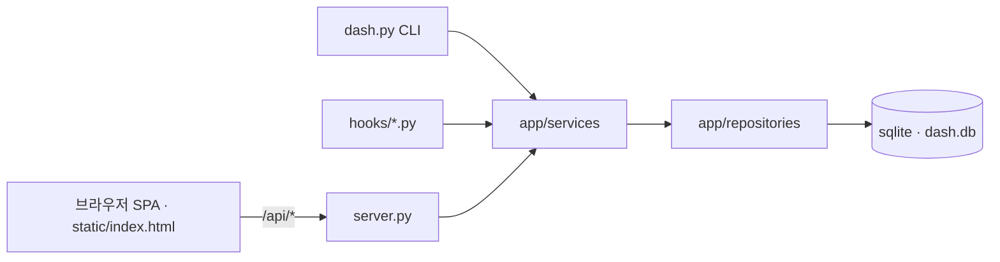

# work-dashboard

work-dashboard 는 Claude Code 로 하는 작업을 한 화면에서 관리하는 로컬 대시보드입니다.
카테고리 · 워크스페이스 · 할일 · 하위 할일 트리를 sqlite 에 담고, 돌고 있는 Claude Code
세션을 훅으로 그 트리에 붙입니다. 브라우저 화면과 CLI 가 같은 DB 를 보기 때문에,
세션 안의 Claude 도 사람과 같은 목록을 읽고 상태를 바꿀 수 있습니다.

혼자 쓰는 로컬 도구입니다. 인증이 없고 `127.0.0.1` 에만 바인딩합니다.

## 주요 기능

- **할일 트리** — 카테고리 → 워크스페이스 → 할일 → 하위 할일. 워크스페이스에는
  배경 · 목적 · 목표 · 고려사항과 Jira ID 를 붙일 수 있습니다.
- **세션 연결** — Claude Code 훅이 세션의 시작 · 지시 · 정지 · 종료를 받아
  `working` / `idle` / `ended` 상태와 마지막 지시, 브랜치를 기록합니다.
- **워크트리 탭** — 워크스페이스별 저장소의 브랜치 · 워크트리와, 그 워크트리를
  서비스하는 서버 포트를 보여주고 병합 · 버리기 · 서버 실행을 한 자리에서 처리합니다.
- **사용량 통계** — 5시간 창과 주간 창의 한도 사용률, 일자별 토큰 · 비용 추이,
  주차 비교를 그립니다.
- **자율 실행** — `auto` 라벨이 붙고 착수 조건이 없는 할일을 5분 크론이 골라
  `claude --bg` 잡 한 건으로 돌리고, 결과를 검토 대기 상태로 남깁니다.
- **CLI 우선** — 화면에서 하는 거의 모든 일이 `dash.py` 서브커맨드로도 됩니다.
  `--json` 을 붙이면 세션 안의 Claude 가 그대로 파싱합니다.

## 빠른 시작

필요한 것은 Python 3.9 이상과 git 뿐입니다. 서드파티 패키지는 쓰지 않습니다
(`argparse` · `http.server` · `sqlite3` 등 표준 라이브러리만 사용).
프로세스 탐지에 `pgrep` · `lsof` 를 쓰므로 macOS · Linux 에서 동작합니다.

```bash
git clone <이 저장소> work-dashboard
cd work-dashboard
./start.sh
```

```console
$ ./start.sh
http://127.0.0.1:9080
pid 86573 · 로그 logs/2026-08-05.log
```

주소를 열면 보드 · 워크스페이스 · 사용 통계 · 설정 네 탭이 있는 화면이 나옵니다.
DB 는 첫 실행 때 `~/.claude/work-dashboard/dash.db` 에 만들어지고, 카테고리 6종
(개발 · 운영 · 장애 대응 · 개발환경 개선 · 스킬 개발 · 프로세스 개선)이 기본으로 들어갑니다.

멈출 때는 `./stop.sh`, 같은 포트로 다시 띄울 때는 `./restart.sh` 입니다.

## 설치

별도 설치 단계가 없습니다. 저장소를 클론한 위치에서 바로 실행합니다.
Claude Code 세션을 보드에 붙이려면 훅을 등록해야 합니다 (아래 Claude Code 훅 절 참고).

확인:

```bash
python3 dash.py ls
python3 -m tests
```

## CLI 사용법

모든 명령은 저장소 루트에서 `python3 dash.py <서브커맨드>` 로 실행합니다.

### 할일 만들고 다음 할 일 꺼내기

```console
$ python3 dash.py add-todo "README 초안 검토" --category 개발
1. README 초안 검토

$ python3 dash.py next
미분류 / README 초안 검토

$ python3 dash.py ls
미분류  0/1
  [todo] 1. README 초안 검토
```

`ls` 는 기본적으로 워크스페이스로 묶습니다. 카테고리로 묶으려면:

```console
$ python3 dash.py ls --group-by category
개발  0/1
  [todo] 1. README 초안 검토
```

### 상태 바꾸고 오늘 한 일 보기

```console
$ python3 dash.py set-status todo 1 done
README 초안 검토 → done

$ python3 dash.py done-today
- 미분류 / README 초안 검토
```

`set-status` 의 첫 인자는 `todo` · `subtask` · `workspace` 중 하나입니다.

### 사용량 보기

```console
$ python3 dash.py usage
플랜: 알 수 없음
현재 세션 (5시간): 36.0%  (초기화 08/06 03:30)
이번 주 (전체 모델): 3.0%  (초기화 08/11 04:00)
※ 사이드카에 없는 창: 이번 주 (Sonnet 전용), 모델별 주간 창
2026-07-30  6.8M 토큰  $24.85
```

한도 %는 Claude Code 가 남기는 사이드카 파일에서 읽습니다. 그 파일이 없으면
플랜과 창 정보는 비고, 토큰 · 비용 추이만 나옵니다.

### 세션에서 쓰는 명령

세션 안에서 실행하면 `session` 인자를 생략할 수 있습니다
(환경변수 `CLAUDE_CODE_SESSION_ID` 로 자기 세션을 찾습니다).

| 명령 | 하는 일 |
| --- | --- |
| `sessions` | 활성 세션 목록 |
| `classify <session> --category/--workspace` | 세션을 카테고리 · 워크스페이스에 분류 |
| `link-todo <session> <todo_id>` | 세션이 만든 할일을 세션에 연결 |
| `merge [<session>] --worktree <경로>` | 테스트 후 병합 |
| `finish [<session>]` | 병합 뒤 정리 (할일 done · 서버 종료) |
| `statusline [<session>] --cwd <경로>` | 상태줄 한 줄 |
| `autorun on/off/status` | 자율 실행 스위치 |
| `autorun-tick --dry-run` | 자율 실행 판정만 (5분 크론이 쓰는 명령) |

전체 목록은 `python3 dash.py --help` 로 봅니다. `ls` · `next` · `show` · `usage` ·
`sessions` 등 조회 계열에는 `--json` 이 있습니다.

## 서버 스크립트

세 스크립트 모두 자기 디렉토리를 cwd 로 돌고 있는 서버만 다룹니다. 워크트리마다
포트를 달리해 여러 개를 동시에 띄워도 서로를 죽이지 않습니다.

| 스크립트 | 하는 일 |
| --- | --- |
| `./start.sh [--port N] [--host H]` | 백그라운드로 띄우고 URL 한 줄과 pid 출력 |
| `./stop.sh` | 이 디렉토리에서 돌던 서버만 종료 |
| `./restart.sh [--port N]` | 종료 후 재기동. 인자를 생략하면 돌던 서버의 포트를 물려받음 |

로그는 `logs/YYYY-MM-DD.log` 에 쌓이고 7일이 지난 파일은 `start.sh` 가 지웁니다.
`serving.sh` 는 `stop.sh` · `restart.sh` 가 source 하는 공용 프로세스 탐지 부분이라
직접 실행하지 않습니다.

## 설정

| 항목 | 기본값 | 설명 |
| --- | --- | --- |
| `WORK_DASHBOARD_DB` | `~/.claude/work-dashboard/dash.db` | sqlite 파일 경로 |
| `CLAUDE_CODE_SESSION_ID` | (세션이 주입) | CLI 가 자기 세션을 찾는 값 |
| `--host` | `127.0.0.1` | 바인딩 주소 |
| `--port` | `9080` | 포트 |

DB 는 저장소 밖에 둡니다. 저장소 안에 sqlite 파일이 생기면 워크트리가 계속 dirty 로
잡혀 자율 실행이 멈추기 때문입니다.

## HTTP API

화면(`static/index.html`)이 쓰는 JSON API 입니다. 경로는 모두 `/api/` 로 시작하고,
응답은 도메인 오류에 따라 400 · 404 · 409 로 갈립니다.

| 메서드 | 경로 | 용도 |
| --- | --- | --- |
| GET | `/api/tree?group_by=workspace` 또는 `category` | 보드 트리 |
| GET | `/api/next`, `/api/done-today?date=` | 다음 할 일 · 완료 목록 |
| GET | `/api/categories`, `/api/labels`, `/api/workspaces[/id]`, `/api/todos/<id>` | 조회 |
| GET | `/api/sessions[/id]`, `/api/usage`, `/api/worktrees`, `/api/autorun` | 세션 · 사용량 · 워크트리 · 자율 실행 |
| POST | `/api/categories`, `/api/labels`, `/api/workspaces`, `/api/todos`, `/api/subtasks` | 생성 |
| POST | `/api/reorder`, `/api/worktrees` | 순서 변경 · 워크트리 조작 |
| PATCH | `/api/<종류>/<id>`, `/api/autorun`, `/api/autorun-runs/<id>` | 수정 |
| DELETE | `/api/<종류>/<id>[?force=1]` | 삭제 |

예:

```console
$ curl -s http://127.0.0.1:9080/api/tree
{"group_by": "workspace", "groups": [{"kind": "unassigned", "id": null,
 "name": "미분류", "done_count": 1, "total_count": 1, "todos": [...]}]}
```

확장자가 없는 경로는 `index.html` 로 떨어져 SPA 가 라우팅합니다. 정적 파일은
`static/` 아래의 `.html` · `.css` · `.js` 만 서빙합니다.

## 구조



- `server.py` — 라우팅과 직렬화만 합니다. 도메인 로직을 갖지 않습니다.
- `dash.py` — 인자 파싱 · 위임 · 출력만 합니다. 역시 로직을 갖지 않습니다.
- `app/services/` — 판단이 있는 곳. 보드 집계, 병합, 워크트리 조회, 세션 연결,
  사용량 집계, 자율 실행 판정, transcript 읽기 등.
- `app/repositories/` — 테이블 단위 CRUD. `app/db.py` 의 `connect()` 만 씁니다.
- `app/constants.py` — 매직넘버와 사용자용 문구를 한 곳에 모아 화면 · CLI · 훅이
  같은 값을 씁니다.

## Claude Code 훅

훅은 모두 실패하면 조용히 exit 0 입니다. 훅 오류로 세션이 막히는 쪽이 더 큰 사고라는
원칙을 공유합니다. `.claude/settings.json` 에는 저장소가 공유하는 등록만 커밋되어
있고(`worktree_serve.py`), 나머지는 각자 필요한 이벤트에 등록해서 씁니다.

| 파일 | 이벤트 | 하는 일 |
| --- | --- | --- |
| `hooks/dash_hook.py` | SessionStart · UserPromptSubmit · Stop · SessionEnd | 세션 상태 · 마지막 지시 · 브랜치를 DB 에 기록 |
| `hooks/worktree_serve.py` | Stop | 워크트리를 고쳤는데 서비스하는 서버가 없으면 종료를 막고 주소를 알리게 함 |
| `hooks/worktree_guard.py` | PreToolUse | `~/work/` 레포의 메인 체크아웃에서 소스 편집 차단 |
| `hooks/commit_scope_guard.py` | PreToolUse | `git add -A` · `git commit -a` 같은 전체 스테이징 · 전체 커밋 차단 |
| `hooks/stale_base.py` | UserPromptSubmit | 브랜치가 upstream 이나 기준 브랜치보다 뒤처졌으면 한 줄 경고 |
| `hooks/md_lint.py` | PostToolUse | 저장된 `.md` 를 `markdownlint-cli2` 로 검사 (미설치면 통과) |

## 테스트

```console
$ python3 -m tests
...
----------------------------------------------------------------------
Ran 524 tests in 21.566s

OK
```

`unittest` 로 `tests/test_*.py` 를 모두 돌립니다. 프론트엔드 계약 테스트는
`tests/*_check.mjs` 를 `node` 로 실행하는데, `node` 가 없으면 그 항목만 skip 됩니다.
`hooks/md_lint.py` 를 쓰려면 `npm i -g markdownlint-cli2` 가 필요합니다.

## 한계와 하지 않는 것

- **1인용 로컬 도구입니다.** 인증 · 권한 · 다중 사용자가 없습니다. `127.0.0.1`
  밖으로 열면 DB 를 아무나 고칠 수 있습니다.
- **macOS · Linux 만 지원합니다.** 서버 탐지가 `pgrep` · `lsof` · `/proc` 에
  의존합니다.
- **화면과 CLI 문구는 한국어입니다.** 다국어 지원 계획이 없습니다.
- **Claude Code 에 붙어 있습니다.** 세션 · 사용량 · transcript 기능은
  `~/.claude/` 아래의 파일 구조를 전제로 하며, 그 형식이 바뀌면 해당 칸만 비웁니다.
- **자율 실행은 동시 1건입니다.** 사용량 창을 나눠 쓰면 둘 다 리밋에 걸리고
  diff 가 섞이므로 늘리지 않습니다.
- **패키지로 배포하지 않습니다.** PyPI 등에 올라간 것이 없고 클론해서 씁니다.

## 라이선스

저장소에 LICENSE 파일이 없습니다. 개인용 저장소이므로 별도로 명시하지 않았습니다.
공개하거나 남에게 넘길 때는 라이선스를 먼저 정해야 합니다.
